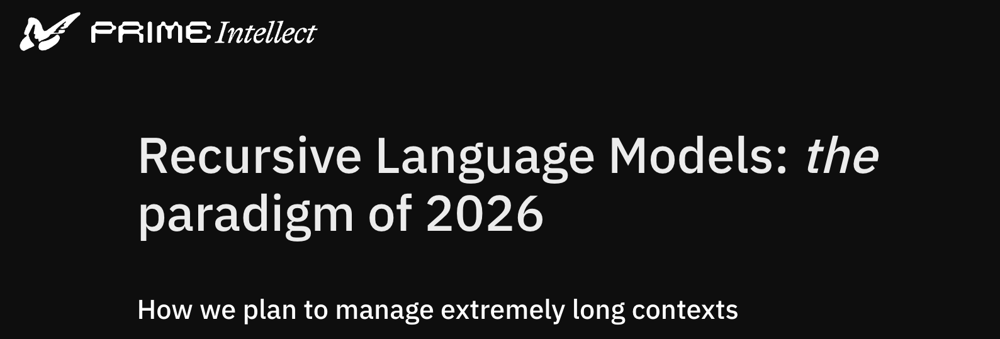
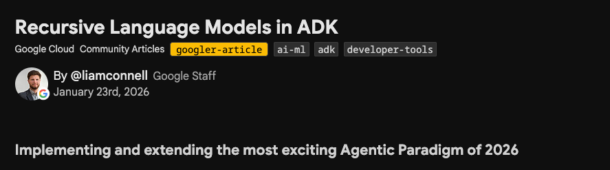
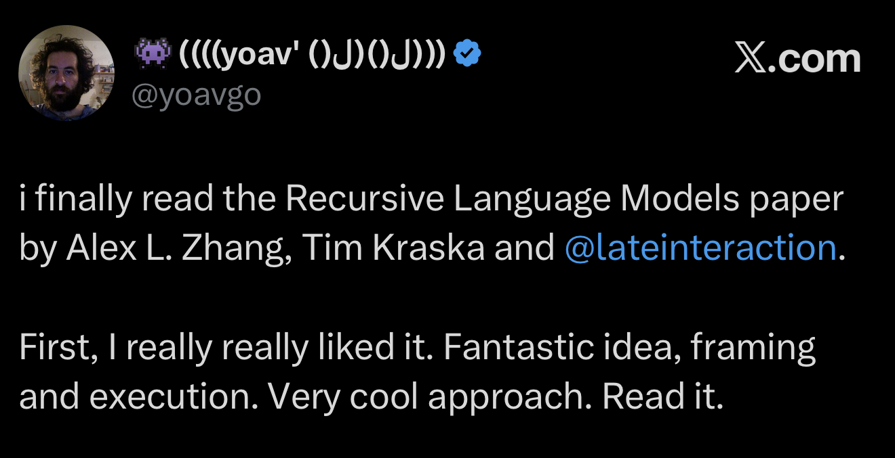
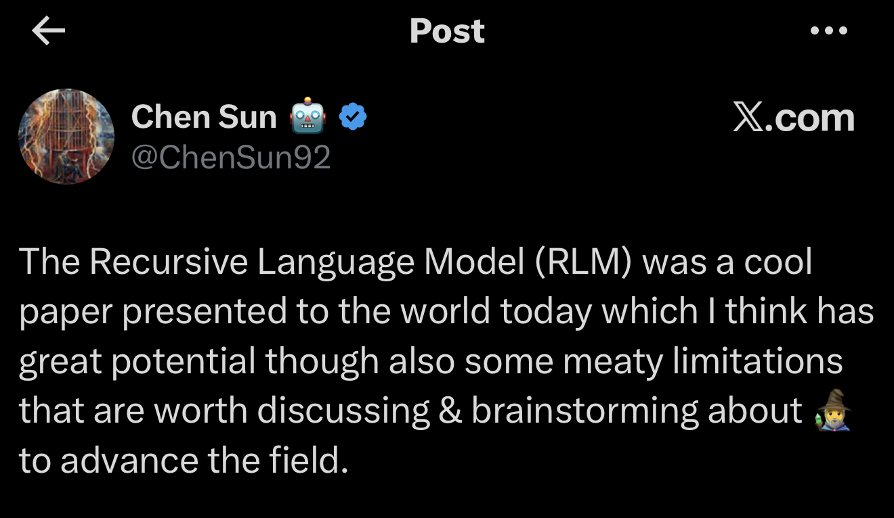
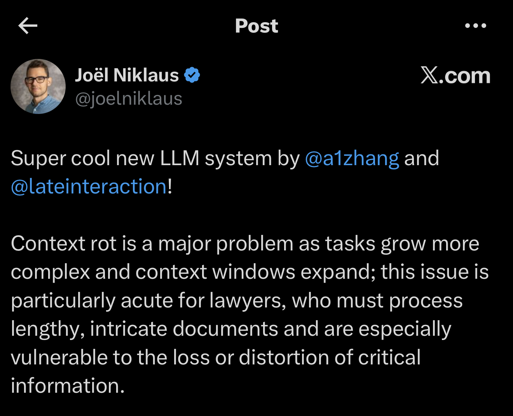

# 🧠 When Context Becomes a Systems Problem: Recursive Language Models

## From MIT Paper to Practical Implementation

**Rethinking how LLMs handle long contexts**

---

# 🤔 The Problem We All Know

Imagine your org has 50,000 GitHub issues across 300 repos...

<div style="background:#0f172a; border:1px solid #334155; border-radius:12px; overflow:hidden; margin-top:16px;">
  <div style="background:#1e293b; border-bottom:1px solid #334155; padding:8px 14px; display:flex; align-items:center; gap:8px;">
    <span style="color:#ef4444; font-size:0.7em;">●</span>
    <span style="color:#eab308; font-size:0.7em;">●</span>
    <span style="color:#22c55e; font-size:0.7em;">●</span>
    <span style="color:#94a3b8; font-size:0.62em; margin-left:8px;">AI Assistant</span>
  </div>
  <div style="padding:16px;">
  <div style="margin-bottom:14px;">
    <div style="font-size:0.6em; color:#60a5fa; margin-bottom:5px; font-weight:bold;">Engineer</div>
    <div style="background:rgba(96,165,250,0.12); border:1px solid #60a5fa; border-radius:2px 12px 12px 12px; padding:10px 14px; max-width:75%; font-size:0.82em;">
      "Checkout, inventario y Notificaciones tuvieron incidentes el Q3. ¿Hay algún patrón común?"
    </div>
  </div>
  <div style="margin:8px 0 14px;">
    <div style="display:flex; height:4px; border-radius:2px; overflow:hidden; margin-bottom:4px;">
      <div style="width:2%; background:#60a5fa;"></div>
      <div style="width:98%; background:#1e293b;"></div>
    </div>
    <div style="font-size:0.55em; color:#475569; text-align:center;">processing <span style="color:#60a5fa;">1,000</span> / 50,000 issues...</div>
  </div>
  <div style="display:flex; flex-direction:column; align-items:flex-end;">
    <div style="font-size:0.6em; color:#22c55e; margin-bottom:5px; font-weight:bold;">LLM</div>
    <div style="background:rgba(34,197,94,0.08); border:1px solid #22c55e; border-radius:12px 2px 12px 12px; padding:10px 14px; max-width:75%; font-size:0.82em;">
      <div style="color:#22c55e; font-size:0.72em; margin-bottom:4px;">✓ Analysis complete</div>
      "<strong>Checkout</strong> tuvo un pico de errores 503 en semana 8.  <strong>Inventario</strong> reportó timeouts no relacionados. <strong>Notificaciones</strong>: fallo puntual de integración. No se detecta patrón común."
      <br/>
      <div style="color:#facc15; font-size:0.72em; margin-bottom:4px;">⚠ 49,000 issues not analyzed</div>
    </div>
  </div>
  </div>
</div>

<!--

¿Cuáles son las opciones que tenemos hoy?
-->

---

# 🤔 The Problem We All Know

Imagine your org has 50,000 GitHub issues across 300 repos...

**Current solutions:**

<div style="display:flex; gap:12px; margin-top:12px;">
  <div style="flex:1; background:rgba(239,68,68,0.1); border:1px solid #ef4444; border-radius:10px; padding:12px;">
    <div style="font-size:1.3em; margin-bottom:4px;">❌ Truncation</div>
    <div style="color:#94a3b8; font-size:0.85em;">Loses crucial information</div>
  </div>
  <div style="flex:1; background:rgba(234,179,8,0.1); border:1px solid #eab308; border-radius:10px; padding:12px; visibility:hidden;">
    <div style="font-size:1.3em; margin-bottom:4px;">⚠️ RAG</div>
    <div style="color:#94a3b8; font-size:0.85em;">Needs a query — but the pattern is the unknown</div>
    <div style="display:inline-block; background:rgba(234,179,8,0.12); border:1px solid rgba(234,179,8,0.4); border-radius:5px; padding:2px 8px; font-size:0.7em; color:#eab308; margin-top:6px;">🔍 query generation problem</div>
  </div>
  <div style="flex:1; background:rgba(239,68,68,0.1); border:1px solid #ef4444; border-radius:10px; padding:12px; visibility:hidden;">
    <div style="font-size:1.3em; margin-bottom:4px;">❌ Long-context</div>
    <div style="color:#94a3b8; font-size:0.85em;">Performance still degrades with length</div>
  </div>
</div>

<!--
Truncation: lo más sencillo. Si los 50.000 issues no caben, se procesan los primeros N. Si el issue clave estaba en el repo 250, mala suerte.

El engineer habrá analizado una muestra sesgada sin saberlo — lo peor porque da una falsa sensación de cobertura.

→ ¿Y si en vez de cortar, recuperamos solo lo relevante?
-->

---

# 🤔 The Problem We All Know

Imagine your org has 50,000 GitHub issues across 300 repos...

**Current solutions:**

<div style="display:flex; gap:12px; margin-top:12px;">
  <div style="flex:1; background:rgba(239,68,68,0.1); border:1px solid #ef4444; border-radius:10px; padding:12px;">
    <div style="font-size:1.3em; margin-bottom:4px;">❌ Truncation</div>
    <div style="color:#94a3b8; font-size:0.85em;">Loses crucial information</div>
  </div>
  <div style="flex:1; background:rgba(234,179,8,0.1); border:1px solid #eab308; border-radius:10px; padding:12px;">
    <div style="font-size:1.3em; margin-bottom:4px;">⚠️ RAG</div>
    <div style="color:#94a3b8; font-size:0.85em;">Needs a query — but the pattern is the unknown</div>
    <div style="display:inline-block; background:rgba(234,179,8,0.12); border:1px solid rgba(234,179,8,0.4); border-radius:5px; padding:2px 8px; font-size:0.7em; color:#eab308; margin-top:6px;">🔍 query generation problem</div>
  </div>
  <div style="flex:1; background:rgba(239,68,68,0.1); border:1px solid #ef4444; border-radius:10px; padding:12px; visibility:hidden;">
    <div style="font-size:1.3em; margin-bottom:4px;">❌ Long-context</div>
    <div style="color:#94a3b8; font-size:0.85em;">Performance still degrades with length</div>
  </div>
</div>

<!--
Que buscamos exactamente?

Cada issue parece un bug distinto, y el patron solo emerge leyendo muchos issues juntos y correlacionando patrones.

RAG necesita una query y aqui no sabemos que preguntar — el patrón es lo que buscamos. No es que RAG esté roto — es que para tareas de descubrimiento donde no sabes qué buscar, no puedes formular la query. Es un problema semántico de generación de query, no de infraestructura.

→ ¿Y si simplemente ampliamos la ventana de contexto?
-->

---

# 🤔 The Problem We All Know

Imagine your org has 50,000 GitHub issues across 300 repos...

**Current solutions:**

<div style="display:flex; gap:12px; margin-top:12px;">
  <div style="flex:1; background:rgba(239,68,68,0.1); border:1px solid #ef4444; border-radius:10px; padding:12px;">
    <div style="font-size:1.3em; margin-bottom:4px;">❌ Truncation</div>
    <div style="color:#94a3b8; font-size:0.85em;">Loses crucial information</div>
  </div>
  <div style="flex:1; background:rgba(234,179,8,0.1); border:1px solid #eab308; border-radius:10px; padding:12px;">
    <div style="font-size:1.3em; margin-bottom:4px;">⚠️ RAG</div>
    <div style="color:#94a3b8; font-size:0.85em;">Needs a query — but the pattern is the unknown</div>
    <div style="display:inline-block; background:rgba(234,179,8,0.12); border:1px solid rgba(234,179,8,0.4); border-radius:5px; padding:2px 8px; font-size:0.7em; color:#eab308; margin-top:6px;">🔍 query generation problem</div>
  </div>
  <div style="flex:1; background:rgba(239,68,68,0.1); border:1px solid #ef4444; border-radius:10px; padding:12px;">
    <div style="font-size:1.3em; margin-bottom:4px;">❌ Long-context</div>
    <div style="color:#94a3b8; font-size:0.85em;">Performance still degrades with length</div>
  </div>
</div>

<!--

Ventana más grande, mismo problema: el rendimiento sigue cayendo cuanto más crece el contexto. Y pagas por cada token aunque el modelo no los procese bien.


→ Ese fenómeno de degradación tiene nombre.
-->

---

# 📉 Context Rot is Real

<div class="columns">
<div>

<div style="display:flex; flex-direction:column; gap:10px; margin-top:6px;">
  <div style="background:rgba(34,197,94,0.12); border:1px solid #22c55e; border-radius:10px; padding:11px; display:flex; align-items:center; gap:10px;">
    <div style="font-size:1.4em;">✅</div>
    <div>
      <div style="font-size:0.95em; font-weight:600; color:#86efac;">Short context</div>
      <div style="font-size:0.8em; color:#94a3b8;">High accuracy — model handles it well</div>
    </div>
  </div>
  <div style="text-align:center; color:#475569; font-size:0.85em;">↓ same model, more context</div>
  <div style="background:rgba(234,179,8,0.12); border:1px solid #eab308; border-radius:10px; padding:11px; display:flex; align-items:center; gap:10px;">
    <div style="font-size:1.4em;">⚠️</div>
    <div>
      <div style="font-size:0.95em; font-weight:600; color:#fde68a;">Medium context</div>
      <div style="font-size:0.8em; color:#94a3b8;">Quality starts dropping — still within window</div>
    </div>
  </div>
  <div style="text-align:center; color:#475569; font-size:0.85em;">↓ keep going</div>
  <div style="background:rgba(239,68,68,0.15); border:1px solid #ef4444; border-radius:10px; padding:11px; display:flex; align-items:center; gap:10px;">
    <div style="font-size:1.4em;">💥</div>
    <div>
      <div style="font-size:0.95em; font-weight:600; color:#fca5a5;">Long context</div>
      <div style="font-size:0.8em; color:#94a3b8;">Collapses — <em>before</em> hitting the limit</div>
    </div>
  </div>
</div>

<div style="background:rgba(239,68,68,0.08); border-left:3px solid #ef4444; border-radius:0 6px 6px 0; padding:7px 12px; font-size:0.8em; color:#e2e8f0; margin-top:12px;">
  Not just a window size problem — <strong>attention dilutes with length</strong>
</div>

</div>
<div>

**Real example (Figure 2, MIT paper):**

```
"In chapter 1, Alice and Bob are alive...

[hundreds of pages]

...In chapter 25, Bob died.

[hundreds of pages]

...In chapter 50: who died?"

GPT-5: "Alice" ❌
```

<div style="background:rgba(239,68,68,0.08); border:1px solid #475569; border-radius:8px; padding:8px 12px; font-size:0.82em; color:#94a3b8; margin-top:8px;">The model didn't hit a hard limit — it <strong style="color:#fca5a5;">degraded</strong> as the context grew.</div>

</div>
</div>

<!--
Estudios realizados con benchmars del estilo "needle-in-a-haystack", han revelado que el fenomeno de Context Rot es real: a medida que el contexto crece, la calidad de las respuestas cae estrepitosamente, incluso antes de llegar al límite de tokens.

Hablar de Context Anxiety

Algunos modelos también muestran "ansiedad contextual", en la que comienzan a finalizar el trabajo prematuramente a medida que se acercan a lo que creen que es su límite contextual.
-->

---

<div style="font-size: 0.85em; color: #93c5fd; margin-bottom: 1rem;">💡 The Brilliant Insight from MIT</div>

<div style="font-size: 2.4em; font-weight: 700; color: #60a5fa; text-shadow: 0 0 20px rgba(96,165,250,0.4);">What if we treat the context as part of the <em>environment</em> instead of loading it all into memory?</div>

---

# 💡 The Brilliant Insight from MIT

> **What if we treat the context as part of the _environment_ instead of loading it all into memory?**

Like a programmer with a huge file:

<div style="display:flex; gap:12px; margin-top:14px;">
  <div style="flex:1; background:rgba(239,68,68,0.1); border:1px solid #ef4444; border-radius:10px; padding:14px; text-align:center !important;">
    <div style="font-size:1.6em;">🚫</div>
    <div style="font-size:0.95em; margin-top:4px; color:#fca5a5; font-weight:600;">Don't load everything</div>
    <div style="font-size:0.8em; color:#94a3b8; margin-top:2px;">RAM would explode — so why do we do this with LLMs?</div>
  </div>
  <div style="flex:1; background:rgba(234,179,8,0.12); border:1px solid #eab308; border-radius:10px; padding:14px; text-align:center !important; visibility:hidden;">
    <div style="font-size:1.6em;">🔎</div>
    <div style="font-size:0.95em; margin-top:4px; color:#fde68a; font-weight:600;">Search on demand</div>
    <div style="font-size:0.8em; color:#94a3b8; margin-top:2px;">Open, grep, filter — inspect only what matters</div>
  </div>
  <div style="flex:1; background:rgba(34,197,94,0.12); border:1px solid #22c55e; border-radius:10px; padding:14px; text-align:center !important; visibility:hidden;">
    <div style="font-size:1.6em;">🧬</div>
    <div style="font-size:0.95em; margin-top:4px; color:#86efac; font-weight:600;">Recurse & conquer</div>
    <div style="font-size:0.8em; color:#94a3b8; margin-top:2px;">Split the problem, delegate to sub-calls, merge results</div>
  </div>
</div>

<!--
-->

---

# 💡 The Brilliant Insight from MIT

> **What if we treat the context as part of the _environment_ instead of loading it all into memory?**

Like a programmer with a huge file:

<div style="display:flex; gap:12px; margin-top:14px;">
  <div style="flex:1; background:rgba(239,68,68,0.1); border:1px solid #ef4444; border-radius:10px; padding:14px; text-align:center !important;">
    <div style="font-size:1.6em;">🚫</div>
    <div style="font-size:0.95em; margin-top:4px; color:#fca5a5; font-weight:600;">Don't load everything</div>
    <div style="font-size:0.8em; color:#94a3b8; margin-top:2px;">RAM would explode — so why do we do this with LLMs?</div>
  </div>
  <div style="flex:1; background:rgba(234,179,8,0.12); border:1px solid #eab308; border-radius:10px; padding:14px; text-align:center !important;">
    <div style="font-size:1.6em;">🔎</div>
    <div style="font-size:0.95em; margin-top:4px; color:#fde68a; font-weight:600;">Search on demand</div>
    <div style="font-size:0.8em; color:#94a3b8; margin-top:2px;">Open, grep, filter — inspect only what matters</div>
  </div>
  <div style="flex:1; background:rgba(34,197,94,0.12); border:1px solid #22c55e; border-radius:10px; padding:14px; text-align:center !important; visibility:hidden;">
    <div style="font-size:1.6em;">🧬</div>
    <div style="font-size:0.95em; margin-top:4px; color:#86efac; font-weight:600;">Recurse & conquer</div>
    <div style="font-size:0.8em; color:#94a3b8; margin-top:2px;">Split the problem, delegate to sub-calls, merge results</div>
  </div>
</div>

<!--

-->

---

# 💡 The Brilliant Insight from MIT

> **What if we treat the context as part of the _environment_ instead of loading it all into memory?**

Like a programmer with a huge file:

<div style="display:flex; gap:12px; margin-top:14px;">
  <div style="flex:1; background:rgba(239,68,68,0.1); border:1px solid #ef4444; border-radius:10px; padding:14px; text-align:center !important;">
    <div style="font-size:1.6em;">🚫</div>
    <div style="font-size:0.95em; margin-top:4px; color:#fca5a5; font-weight:600;">Don't load everything</div>
    <div style="font-size:0.8em; color:#94a3b8; margin-top:2px;">RAM would explode — so why do we do this with LLMs?</div>
  </div>
  <div style="flex:1; background:rgba(234,179,8,0.12); border:1px solid #eab308; border-radius:10px; padding:14px; text-align:center !important;">
    <div style="font-size:1.6em;">🔎</div>
    <div style="font-size:0.95em; margin-top:4px; color:#fde68a; font-weight:600;">Search on demand</div>
    <div style="font-size:0.8em; color:#94a3b8; margin-top:2px;">Open, grep, filter — inspect only what matters</div>
  </div>
  <div style="flex:1; background:rgba(34,197,94,0.12); border:1px solid #22c55e; border-radius:10px; padding:14px; text-align:center !important;">
    <div style="font-size:1.6em;">🧬</div>
    <div style="font-size:0.95em; margin-top:4px; color:#86efac; font-weight:600;">Recurse & conquer</div>
    <div style="font-size:0.8em; color:#94a3b8; margin-top:2px;">Split the problem, delegate to sub-calls, merge results</div>
  </div>
</div>

---

# 💡 The Brilliant Insight from MIT

> **What if we treat the context as part of the _environment_ instead of loading it all into memory?**

Like a programmer with a huge file:

<div style="display:flex; gap:12px; margin-top:14px;">
  <div style="flex:1; background:rgba(239,68,68,0.1); border:1px solid #ef4444; border-radius:10px; padding:14px; text-align:center !important;">
    <div style="font-size:1.6em;">🚫</div>
    <div style="font-size:0.95em; margin-top:4px; color:#fca5a5; font-weight:600;">Don't load everything</div>
    <div style="font-size:0.8em; color:#94a3b8; margin-top:2px;">RAM would explode — so why do we do this with LLMs?</div>
  </div>
  <div style="flex:1; background:rgba(234,179,8,0.12); border:1px solid #eab308; border-radius:10px; padding:14px; text-align:center !important;">
    <div style="font-size:1.6em;">🔎</div>
    <div style="font-size:0.95em; margin-top:4px; color:#fde68a; font-weight:600;">Search on demand</div>
    <div style="font-size:0.8em; color:#94a3b8; margin-top:2px;">Open, grep, filter — inspect only what matters</div>
  </div>
  <div style="flex:1; background:rgba(34,197,94,0.12); border:1px solid #22c55e; border-radius:10px; padding:14px; text-align:center !important;">
    <div style="font-size:1.6em;">🧬</div>
    <div style="font-size:0.95em; margin-top:4px; color:#86efac; font-weight:600;">Recurse & conquer</div>
    <div style="font-size:0.8em; color:#94a3b8; margin-top:2px;">Split the problem, delegate to sub-calls, merge results</div>
  </div>
</div>

<div style="background:linear-gradient(135deg, rgba(96,165,250,0.2), rgba(168,85,247,0.2)); border:2px solid #60a5fa; border-radius:12px; padding:12px; text-align:center !important; margin-top:16px; font-size:1.15em; font-weight:700; color:#e2e8f0;">
  🧠 This is <span style="color:#60a5fa;">RLM</span>: Recursive Language Models
</div>

<!--

Tres ideas sencillas. Juntas eliminan el context rot: el modelo siempre trabaja sobre trozos pequeños, sin importar el tamaño total.

-->

---

# 🏗️ The 3 Defining Properties of RLM

From the paper (MIT CSAIL 2025):

<div style="display:flex; flex-direction:column; gap:10px; margin-top:14px;">
  <div style="display:flex; align-items:stretch; gap:12px;">
    <div style="background:rgba(234,179,8,0.15); border:2px solid #eab308; border-radius:12px; padding:14px 16px; flex:1; display:flex; align-items:center; gap:14px;">
      <div style="font-size:2em; min-width:48px; text-align:center !important;">📌</div>
      <div>
        <div style="font-size:1.05em; font-weight:700; color:#fde68a;">1 · Symbolic handle to the prompt</div>
        <div style="font-size:0.85em; color:#94a3b8; margin-top:2px;">Context stored as variable <code style="background:rgba(255,255,255,0.08); color:#fbbf24;">P</code> inside an environtment — never inside the neural network</div>
      </div>
    </div>
  </div>
  <div style="display:flex; align-items:stretch; gap:12px; visibility:hidden;">
    <div style="background:rgba(34,197,94,0.12); border:2px solid #22c55e; border-radius:12px; padding:14px 16px; flex:1; display:flex; align-items:center; gap:14px;">
      <div style="font-size:2em; min-width:48px; text-align:center !important;">⚙️</div>
      <div>
        <div style="font-size:1.05em; font-weight:700; color:#86efac;">2 · Persistent Symbolic Programming environment</div>
        <div style="font-size:0.85em; color:#94a3b8; margin-top:2px;">Python REPL that persists across iterations — define functions, accumulate state, build logic</div>
      </div>
    </div>
  </div>
  <div style="display:flex; align-items:stretch; gap:12px; visibility:hidden;">
    <div style="background:rgba(96,165,250,0.15); border:2px solid #3b82f6; border-radius:12px; padding:14px 16px; flex:1; display:flex; align-items:center; gap:14px;">
      <div style="font-size:2em; min-width:48px; text-align:center !important;">🔄</div>
      <div>
        <div style="font-size:1.05em; font-weight:700; color:#93c5fd;">3 · Symbolic recursion</div>
        <div style="font-size:0.85em; color:#94a3b8; margin-top:2px;">LLM calls itself via <code style="background:rgba(255,255,255,0.08); color:#60a5fa;">sub_RLM</code> on context portions — divide and conquer at any depth</div>
      </div>
    </div>
  </div>
</div>

<!--
-->

---

# 🏗️ The 3 Defining Properties of RLM

From the paper (MIT CSAIL 2025):

<div style="display:flex; flex-direction:column; gap:10px; margin-top:14px;">
  <div style="display:flex; align-items:stretch; gap:12px;">
    <div style="background:rgba(234,179,8,0.15); border:2px solid #eab308; border-radius:12px; padding:14px 16px; flex:1; display:flex; align-items:center; gap:14px;">
      <div style="font-size:2em; min-width:48px; text-align:center !important;">📌</div>
      <div>
        <div style="font-size:1.05em; font-weight:700; color:#fde68a;">1 · Symbolic handle to the prompt</div>
        <div style="font-size:0.85em; color:#94a3b8; margin-top:2px;">Context stored as variable <code style="background:rgba(255,255,255,0.08); color:#fbbf24;">P</code> inside an environtment — never inside the neural network</div>
      </div>
    </div>
  </div>
  <div style="display:flex; align-items:stretch; gap:12px;">
    <div style="background:rgba(34,197,94,0.12); border:2px solid #22c55e; border-radius:12px; padding:14px 16px; flex:1; display:flex; align-items:center; gap:14px;">
      <div style="font-size:2em; min-width:48px; text-align:center !important;">⚙️</div>
      <div>
        <div style="font-size:1.05em; font-weight:700; color:#86efac;">2 · Persistent Symbolic Programming environment</div>
        <div style="font-size:0.85em; color:#94a3b8; margin-top:2px;">Python REPL that persists across iterations — define functions, accumulate state, build logic</div>
      </div>
    </div>
  </div>
  <div style="display:flex; align-items:stretch; gap:12px; visibility:hidden;">
    <div style="background:rgba(96,165,250,0.15); border:2px solid #3b82f6; border-radius:12px; padding:14px 16px; flex:1; display:flex; align-items:center; gap:14px;">
      <div style="font-size:2em; min-width:48px; text-align:center !important;">🔄</div>
      <div>
        <div style="font-size:1.05em; font-weight:700; color:#93c5fd;">3 · Symbolic recursion</div>
        <div style="font-size:0.85em; color:#94a3b8; margin-top:2px;">LLM calls itself via <code style="background:rgba(255,255,255,0.08); color:#60a5fa;">sub_RLM</code> on context portions — divide and conquer at any depth</div>
      </div>
    </div>
  </div>
</div>

<!--
Una de las cosas mas interesantes en este punto es que estamos combinando el aspecto "difuso" de los LLms con un verificador "simbolico" tradicional.

 Python
  - ipython — más potente, con autocompletado
  - jupyter — el notebook (celdas = iteraciones RLM)

  JavaScript / Node
  - node — REPL nativo de Node.js
  - deno — alternativa moderna con TypeScript nativo

  Java
  - jshell — REPL oficial desde Java 9 (JEP 222)

→ Y cuando el problema es tan grande que ni el REPL puede de una vez...
-->

---

# 🏗️ The 3 Defining Properties of RLM

From the paper (MIT CSAIL 2025):

<div style="display:flex; flex-direction:column; gap:10px; margin-top:14px;">
  <div style="display:flex; align-items:stretch; gap:12px;">
    <div style="background:rgba(234,179,8,0.15); border:2px solid #eab308; border-radius:12px; padding:14px 16px; flex:1; display:flex; align-items:center; gap:14px;">
      <div style="font-size:2em; min-width:48px; text-align:center !important;">📌</div>
      <div>
        <div style="font-size:1.05em; font-weight:700; color:#fde68a;">1 · Symbolic handle to the prompt</div>
        <div style="font-size:0.85em; color:#94a3b8; margin-top:2px;">Context stored as variable <code style="background:rgba(255,255,255,0.08); color:#fbbf24;">P</code> inside an environtment — never inside the neural network</div>
      </div>
    </div>
  </div>
  <div style="display:flex; align-items:stretch; gap:12px;">
    <div style="background:rgba(34,197,94,0.12); border:2px solid #22c55e; border-radius:12px; padding:14px 16px; flex:1; display:flex; align-items:center; gap:14px;">
      <div style="font-size:2em; min-width:48px; text-align:center !important;">⚙️</div>
      <div>
        <div style="font-size:1.05em; font-weight:700; color:#86efac;">2 · Persistent Symbolic Programming environment</div>
        <div style="font-size:0.85em; color:#94a3b8; margin-top:2px;">Python REPL that persists across iterations — define functions, accumulate state, build logic</div>
      </div>
    </div>
  </div>
  <div style="display:flex; align-items:stretch; gap:12px;">
    <div style="background:rgba(96,165,250,0.15); border:2px solid #3b82f6; border-radius:12px; padding:14px 16px; flex:1; display:flex; align-items:center; gap:14px;">
      <div style="font-size:2em; min-width:48px; text-align:center !important;">🔄</div>
      <div>
        <div style="font-size:1.05em; font-weight:700; color:#93c5fd;">3 · Symbolic recursion</div>
        <div style="font-size:0.85em; color:#94a3b8; margin-top:2px;">LLM calls itself via <code style="background:rgba(255,255,255,0.08); color:#60a5fa;">sub_RLM</code> on context portions — divide and conquer at any depth</div>
      </div>
    </div>
  </div>
</div>

<!--
-->

---

<div style="font-size:1em; color:#94a3b8; font-weight:600; margin-bottom:6px;">⚡ Architecture: Standard LLM</div>
<br>

<div style="display:grid; grid-template-columns:140px 45px 1fr 45px 130px; grid-template-rows:auto auto auto auto auto; align-items:center; gap:0; width:100%; margin-top:8px;">

  <div style="grid-column:3; grid-row:1; font-size:14px; font-weight:800; color:#94a3b8; background:rgba(15,23,42,0.5); border:2px solid #475569; border-bottom:none; border-radius:14px 14px 0 0; padding:10px 16px 6px 16px;">Standard LLM</div>

  <div style="grid-column:1; grid-row:2; text-align:center;">
    <div style="background:rgba(234,179,8,0.15); border:2px solid #eab308; color:#fde68a; border-radius:10px; padding:10px 12px; font-weight:600; font-size:18px;">📋 query</div>
  </div>
  <div style="grid-column:2; grid-row:2; text-align:center;">
    <span style="font-size:24px; color:#eab308;">⟶</span>
  </div>
  <div style="grid-column:3; grid-row:2/5; background:rgba(15,23,42,0.5); border-left:2px solid #475569; border-right:2px solid #475569; padding:6px 16px; display:flex; align-items:center; justify-content:center;">
    <div style="background:rgba(34,197,94,0.15); border:2px solid #22c55e; color:#86efac; border-radius:10px; padding:14px; font-weight:600; font-size:19px; text-align:center; width:100%;">🧠 Language Model<br><span style="font-size:0.65em; font-weight:400; color:#94a3b8;">context window</span></div>
  </div>
  <div style="grid-column:4; grid-row:2/5; text-align:center;">
    <span style="font-size:26px; color:#a855f7;">⟶</span>
  </div>
  <div style="grid-column:5; grid-row:2/5; text-align:center;">
    <div style="background:rgba(168,85,247,0.15); border:2px solid #a855f7; color:#d8b4fe; border-radius:10px; padding:10px 8px; font-weight:600; font-size:16px;">✅ response</div>
  </div>

  <div style="grid-column:1; grid-row:3; height:40px;"></div>

  <div style="grid-column:1; grid-row:4; text-align:center;">
    <div style="background:rgba(234,179,8,0.15); border:2px solid #eab308; color:#fde68a; border-radius:10px; padding:10px 12px; font-weight:600; font-size:18px;">📄 context<br><span style="font-size:13px; font-weight:400;">(1M tokens)</span></div>
  </div>
  <div style="grid-column:2; grid-row:4; text-align:center;">
    <span style="font-size:24px; color:#eab308;">⟶</span>
  </div>

  <div style="grid-column:3; grid-row:5; background:rgba(15,23,42,0.5); border:2px solid #475569; border-top:none; border-radius:0 0 14px 14px; padding:6px 16px 10px 16px; text-align:center; font-size:13px; color:#94a3b8;">
    &nbsp;
  </div>

</div>

---

<div style="font-size:1em; color:#93c5fd; font-weight:600; margin-bottom:6px;">🎯 Architecture: RLM High-Level View</div>
<br>

<div style="display:grid; grid-template-columns:140px 45px 1fr 45px 130px; grid-template-rows:auto auto auto auto; align-items:center; gap:0; width:100%; margin-top:8px;">

  <div style="grid-column:3; grid-row:1; font-size:14px; font-weight:800; color:#93c5fd; background:rgba(30,58,95,0.5); border:2px solid #3b82f6; border-bottom:none; border-radius:14px 14px 0 0; padding:10px 16px 6px 16px;">RLM (root / depth = 0)</div>

  <div style="grid-column:1; grid-row:2; text-align:center;">
    <div style="background:rgba(234,179,8,0.15); border:2px solid #eab308; color:#fde68a; border-radius:10px; padding:10px 12px; font-weight:600; font-size:18px;">📋 query</div>
  </div>
  <div style="grid-column:2; grid-row:2; text-align:center;">
    <span style="font-size:24px; color:#eab308;">⟶</span>
  </div>
  <div style="grid-column:3; grid-row:2; background:rgba(30,58,95,0.5); border-left:2px solid #3b82f6; border-right:2px solid #3b82f6; padding:6px 16px;">
    <div style="background:rgba(34,197,94,0.15); border:2px solid #22c55e; color:#86efac; border-radius:10px; padding:10px 14px; font-weight:600; font-size:19px; text-align:center;">🧠 Language Model</div>
  </div>
  <div style="grid-column:4; grid-row:2/5; text-align:center;">
    <span style="font-size:26px; color:#a855f7;">⟶</span>
  </div>
  <div style="grid-column:5; grid-row:2/5; text-align:center;">
    <div style="background:rgba(168,85,247,0.15); border:2px solid #a855f7; color:#d8b4fe; border-radius:10px; padding:10px 8px; font-weight:600; font-size:16px;">✅ response</div>
  </div>

  <div style="grid-column:3; grid-row:3; background:rgba(30,58,95,0.5); border-left:2px solid #3b82f6; border-right:2px solid #3b82f6; padding:4px 16px; text-align:center;">
    <span style="font-size:16px; color:#94a3b8;">code ↓ &nbsp;&nbsp;<span style="font-size:28px; color:#60a5fa; font-weight:900;">⟳</span>&nbsp;&nbsp; ↑ stdout</span>
  </div>

  <div style="grid-column:1; grid-row:4; text-align:center;">
    <div style="background:rgba(234,179,8,0.15); border:2px solid #eab308; color:#fde68a; border-radius:10px; padding:10px 12px; font-weight:600; font-size:18px;">📄 context<br><span style="font-size:13px; font-weight:400;">(1M tokens)</span></div>
  </div>
  <div style="grid-column:2; grid-row:4; text-align:center;">
    <span style="font-size:24px; color:#eab308;">⟶</span>
  </div>
  <div style="grid-column:3; grid-row:4; background:rgba(30,58,95,0.5); border-left:2px solid #3b82f6; border-right:2px solid #3b82f6; padding:6px 16px;">
    <div style="background:rgba(239,68,68,0.15); border:2px solid #ef4444; color:#fca5a5; border-radius:10px; padding:10px 14px; font-weight:600; font-size:17px; text-align:center;">⚙️ Environment E (Python REPL)</div>
  </div>

  <div style="grid-column:3; grid-row:5; background:rgba(30,58,95,0.5); border:2px solid #3b82f6; border-top:none; border-radius:0 0 14px 14px; padding:6px 16px 10px 16px; text-align:center; font-size:13px; color:#94a3b8;">
    &nbsp;
  </div>

</div>

<!--
NOTAS — Slide 21: Arquitectura limpia

Esta es la vista de alto nivel del RLM — la arquitectura base sin detalles de implementación.

Tres componentes externos: query (lo que se pregunta), context (los datos, hasta 1M tokens), y el response final.

Dentro del RLM hay dos piezas: el Language Model y el Environment (un REPL de Python). El LM genera código, el REPL lo ejecuta, y el stdout vuelve al LM — ese loop es el corazón del sistema.

Lo importante: el context NO se envía al LLM. Se carga como variable P en el REPL. El LLM solo ve metadata.

En la siguiente slide vamos a ver qué herramientas tiene disponible el REPL y cómo termina el proceso.
-->

---

<div style="font-size:1em; color:#93c5fd; font-weight:600; margin-bottom:6px;">🎯 Architecture: RLM High-Level View — Tools & Termination</div>
<br/>

<div style="display:grid; grid-template-columns:140px 45px 1fr 45px 130px; grid-template-rows:auto auto auto auto auto; align-items:center; gap:0; width:100%; margin-top:8px;">

  <div style="grid-column:3; grid-row:1; font-size:14px; font-weight:800; color:#93c5fd; background:rgba(30,58,95,0.5); border:2px solid #3b82f6; border-bottom:none; border-radius:14px 14px 0 0; padding:10px 16px 6px 16px;">RLM (root / depth = 0)</div>

  <div style="grid-column:1; grid-row:2; text-align:center;">
    <div style="background:rgba(234,179,8,0.15); border:2px solid #eab308; color:#fde68a; border-radius:10px; padding:10px 12px; font-weight:600; font-size:18px;">📋 query</div>
  </div>
  <div style="grid-column:2; grid-row:2; text-align:center;">
    <span style="font-size:24px; color:#eab308;">⟶</span>
  </div>
  <div style="grid-column:3; grid-row:2; background:rgba(30,58,95,0.5); border-left:2px solid #3b82f6; border-right:2px solid #3b82f6; padding:6px 16px;">
    <div style="background:rgba(34,197,94,0.15); border:2px solid #22c55e; color:#86efac; border-radius:10px; padding:10px 14px; font-weight:600; font-size:19px; text-align:center;">🧠 Language Model</div>
  </div>
  <div style="grid-column:4; grid-row:2/6; text-align:center;">
    <span style="font-size:26px; color:#a855f7;">⟶</span>
  </div>
  <div style="grid-column:5; grid-row:2/6; text-align:center;">
    <div style="background:rgba(168,85,247,0.15); border:2px solid #a855f7; color:#d8b4fe; border-radius:10px; padding:10px 8px; font-weight:600; font-size:16px;">✅ final<br>response</div>
    <div style="font-size:11px; color:#94a3b8; font-style:italic; margin-top:5px;">FINAL: /<br>FINAL_VAR:</div>
  </div>

  <div style="grid-column:3; grid-row:3; background:rgba(30,58,95,0.5); border-left:2px solid #3b82f6; border-right:2px solid #3b82f6; padding:4px 16px; text-align:center;">
    <span style="font-size:16px; color:#94a3b8;">code ↓ &nbsp;&nbsp;<span style="font-size:28px; color:#60a5fa; font-weight:900;">⟳</span>&nbsp;&nbsp; ↑ stdout</span>
  </div>

  <div style="grid-column:1; grid-row:4; text-align:center;">
    <div style="background:rgba(234,179,8,0.15); border:2px solid #eab308; color:#fde68a; border-radius:10px; padding:10px 12px; font-weight:600; font-size:18px;">📄 context<br><span style="font-size:13px; font-weight:400;">(1M tokens)</span></div>
  </div>
  <div style="grid-column:2; grid-row:4; text-align:center;">
    <span style="font-size:24px; color:#eab308;">⟶</span>
  </div>
  <div style="grid-column:3; grid-row:4; background:rgba(30,58,95,0.5); border-left:2px solid #3b82f6; border-right:2px solid #3b82f6; padding:6px 16px;">
    <div style="background:rgba(239,68,68,0.15); border:2px solid #ef4444; color:#fca5a5; border-radius:10px; padding:10px 14px; font-weight:600; font-size:17px; text-align:center;">
      ⚙️ Environment E (Python REPL)<br>
      <span style="font-size:12px; font-weight:400; color:#cbd5e1;">P = context · llm_query() · extract_after() · peek()</span>
    </div>
  </div>

  <div style="grid-column:3; grid-row:5; background:rgba(30,58,95,0.5); border:2px solid #3b82f6; border-top:none; border-radius:0 0 14px 14px; padding:6px 16px 10px 16px; text-align:center; font-size:13px; color:#94a3b8;">
    REPL calls <code style="color:#f87171; font-weight:700; background:transparent;">llm_query(sub_context)</code> → spawns child RLMs ↓
  </div>

</div>

<!--
NOTAS — Slide 22: Arquitectura con tools y terminación

Ahora sí, los detalles. El Environment tiene estas herramientas disponibles:
- P = context (la variable donde vive el contexto completo)
- llm_query() — para crear RLMs hijos (recursión)
- extract_after() — para extraer fragmentos del contexto
- peek() — para inspeccionar sin consumir

El proceso termina cuando el LLM emite FINAL: (texto libre) o FINAL_VAR: (referencia a variable en el REPL).

Lo clave: llm_query(sub_context) spawns un RLM hijo con su propio REPL — recursión arbitraria con depth ilimitada en teoría.
-->

---

<div style="font-size:0.75em; color:#93c5fd; font-weight:600; margin-bottom:6px;">🎯 Architecture: RLM High-Level View — Recursive Children</div>
<br/>

<div style="display:flex; flex-direction:column; gap:10px;">

  <div style="flex:1; background:rgba(148,163,184,0.08); border:2px dashed #64748b; border-radius:12px; padding:12px;">
    <div style="font-size:18px; font-weight:700; color:#cbd5e1; margin-bottom:8px; text-align:center;">RLM (depth=1)</div>
    <table style="width:100%; border-collapse:collapse;">
      <tr style="vertical-align:middle;">
        <td style="border:none; text-align:center; width:30%; padding:5px;">
          <div style="background:rgba(234,179,8,0.15); border:1px solid #eab308; color:#fde68a; border-radius:8px; padding:8px; font-size:17px; font-weight:600;">📋 sub-query</div>
        </td>
        <td style="border:none; text-align:center; width:8%; font-size:18px; color:#94a3b8; padding:5px;">→<br><span style="font-size:12px;">hist</span></td>
        <td style="border:none; text-align:center; padding:5px;" rowspan="3">
          <div style="background:rgba(34,197,94,0.15); border:1px solid #22c55e; color:#86efac; border-radius:8px; padding:8px; font-size:17px; font-weight:600; margin-bottom:6px;">🧠 LM</div>
          <div style="font-size:14px; color:#94a3b8;">code <span style="color:#60a5fa; font-size:18px;">⟳</span> stdout</div>
          <div style="background:rgba(239,68,68,0.15); border:1px solid #ef4444; color:#fca5a5; border-radius:8px; padding:8px; font-size:17px; font-weight:600; margin-top:6px;">⚙️ REPL (P)</div>
        </td>
        <td style="border:none; text-align:center; width:8%; font-size:18px; color:#94a3b8; padding:5px;" rowspan="3">→</td>
        <td style="border:none; text-align:center; width:26%; padding:5px;" rowspan="3">
          <div style="background:rgba(168,85,247,0.15); border:1px solid #a855f7; color:#d8b4fe; border-radius:8px; padding:8px; font-size:17px; font-weight:600;">✅ result</div>
          <div style="font-size:12px; color:#94a3b8; margin-top:4px;">→ parent REPL<br>as variable</div>
        </td>
      </tr>
      <tr><td style="border:none; padding:3px;"></td><td style="border:none;"></td></tr>
      <tr style="vertical-align:middle;">
        <td style="border:none; text-align:center; padding:5px;">
          <div style="background:rgba(234,179,8,0.15); border:1px solid #eab308; color:#fde68a; border-radius:8px; padding:8px; font-size:17px; font-weight:600;">📄 sub-context</div>
        </td>
        <td style="border:none; text-align:center; font-size:18px; color:#94a3b8; padding:5px;">→<br><span style="font-size:12px;">var P</span></td>
      </tr>
    </table>
    <div style="text-align:center; margin-top:8px; font-size:13px; color:#64748b;">can spawn depth=2 children ↓</div>
  </div>

  <div style="flex:1; background:rgba(148,163,184,0.08); border:2px dashed #64748b; border-radius:12px; padding:12px;">
    <div style="font-size:18px; font-weight:700; color:#cbd5e1; margin-bottom:8px; text-align:center;">RLM (depth=1)</div>
    <table style="width:100%; border-collapse:collapse;">
      <tr style="vertical-align:middle;">
        <td style="border:none; text-align:center; width:30%; padding:5px;">
          <div style="background:rgba(234,179,8,0.15); border:1px solid #eab308; color:#fde68a; border-radius:8px; padding:8px; font-size:17px; font-weight:600;">📋 sub-query</div>
        </td>
        <td style="border:none; text-align:center; width:8%; font-size:18px; color:#94a3b8; padding:5px;">→<br><span style="font-size:12px;">hist</span></td>
        <td style="border:none; text-align:center; padding:5px;" rowspan="3">
          <div style="background:rgba(34,197,94,0.15); border:1px solid #22c55e; color:#86efac; border-radius:8px; padding:8px; font-size:17px; font-weight:600; margin-bottom:6px;">🧠 LM</div>
          <div style="font-size:14px; color:#94a3b8;">code <span style="color:#60a5fa; font-size:18px;">⟳</span> stdout</div>
          <div style="background:rgba(239,68,68,0.15); border:1px solid #ef4444; color:#fca5a5; border-radius:8px; padding:8px; font-size:17px; font-weight:600; margin-top:6px;">⚙️ REPL (P)</div>
        </td>
        <td style="border:none; text-align:center; width:8%; font-size:18px; color:#94a3b8; padding:5px;" rowspan="3">→</td>
        <td style="border:none; text-align:center; width:26%; padding:5px;" rowspan="3">
          <div style="background:rgba(168,85,247,0.15); border:1px solid #a855f7; color:#d8b4fe; border-radius:8px; padding:8px; font-size:17px; font-weight:600;">✅ result</div>
          <div style="font-size:12px; color:#94a3b8; margin-top:4px;">→ parent REPL<br>as variable</div>
        </td>
      </tr>
      <tr><td style="border:none; padding:3px;"></td><td style="border:none;"></td></tr>
      <tr style="vertical-align:middle;">
        <td style="border:none; text-align:center; padding:5px;">
          <div style="background:rgba(234,179,8,0.15); border:1px solid #eab308; color:#fde68a; border-radius:8px; padding:8px; font-size:17px; font-weight:600;">📄 sub-context</div>
        </td>
        <td style="border:none; text-align:center; font-size:18px; color:#94a3b8; padding:5px;">→<br><span style="font-size:12px;">var P</span></td>
      </tr>
    </table>
    <div style="text-align:center; margin-top:8px; font-size:13px; color:#64748b;">can spawn depth=2 children ↓</div>
  </div>

  <div style="text-align:center; font-size:22px; color:#475569; letter-spacing:8px;">⋯</div>

</div>

<div style="text-align:center; margin-top:8px; font-size:14px; color:#94a3b8;">
  Root REPL: <code style="color:#f87171; font-weight:700; background:transparent;">r1 = llm_query(chunk1) &nbsp;·&nbsp; r2 = llm_query(chunk2) &nbsp;·&nbsp; ...</code>
</div>

---

<table style="width:100%; border-collapse:collapse; margin-top:6px;">
<tr style="vertical-align:top;">

<td style="border:none; width:32%; padding-right:10px;">
  <div style="font-size:0.75em; color:#93c5fd; font-weight:700; margin-bottom:10px;">🔄 The Iterative REPL Loop</div>
  <div style="display:flex; flex-direction:column; gap:6px;">
    <div style="background:rgba(34,197,94,0.15); border:2px solid #22c55e; color:#86efac; border-radius:10px; padding:12px; text-align:center; font-weight:600; font-size:19px;">
      🧠 Root LM <span style="font-size:14px; font-weight:400; color:#94a3b8;">(depth=0)</span>
    </div>
    <div style="text-align:center; font-size:14px; color:#94a3b8;">↓</div>
    <div style="background:rgba(234,179,8,0.15); border:2px solid #f59e0b; border-radius:8px; padding:9px 12px; font-size:15px; color:#fde68a;">
      <strong>System prompt:</strong><br><span style="color:#cbd5e1; font-size:14px;">"Answer {query}. Interact with REPL..."</span>
    </div>
    <div style="text-align:center; font-size:14px; color:#94a3b8;">↓</div>
    <div style="background:rgba(34,197,94,0.1); border:2px solid #22c55e; border-radius:8px; padding:9px 12px; font-size:15px; color:#86efac;">
      <strong>LM generates code directly:</strong><br>
      <code style="font-size:14px; background:#0f172a; color:#a5f3fc; padding:2px 6px; border-radius:3px;">chunk_a, chunk_b = P[:len(P)//2], P[len(P)//2:]</code>
    </div>
    <div style="text-align:center; font-size:14px; color:#94a3b8;">↓ Metadata(stdout)</div>
    <div style="background:rgba(239,68,68,0.1); border:2px solid #ef4444; border-radius:8px; padding:9px 12px; font-size:15px; color:#fca5a5;">
      <strong>hist ← hist ∥ code ∥ Metadata(stdout)</strong><br>
      <span style="font-family:monospace; font-size:13px; color:#cbd5e1;">len=48203, prefix="[ context... ]"</span>
    </div>
    <div style="text-align:center; margin:5px 0;">
      <span style="font-size:30px; color:#60a5fa; font-weight:900;">⟳</span><br>
      <span style="font-size:13px; color:#94a3b8;">until <code style="background:transparent; color:#60a5fa;">state[Final]</code></span>
    </div>
    <div style="text-align:center; font-size:14px; color:#94a3b8;">↓</div>
    <div style="background:rgba(168,85,247,0.15); border:2px solid #a855f7; border-radius:8px; padding:9px 12px; font-size:15px; color:#d8b4fe;">
      <strong>Final =</strong> <code style="font-size:14px; background:#0f172a; color:#c4b5fd; padding:2px 6px; border-radius:3px;">res_a + res_b</code>
    </div>
  </div>
</td>

<td style="border:none; width:8%; vertical-align:middle; text-align:center;">
  <div style="display:flex; flex-direction:column; align-items:center; gap:14px;">
    <div>
      <div style="font-size:13px; color:#86efac; margin-bottom:3px;">code</div>
      <div style="font-size:32px; color:#86efac; line-height:1;">⟶</div>
    </div>
    <div>
      <div style="font-size:32px; color:#fca5a5; line-height:1;">⟵</div>
      <div style="font-size:13px; color:#fca5a5; margin-top:3px;">stdout</div>
    </div>
  </div>
</td>

<td style="border:none; padding-left:10px;">
  <div style="font-size:20px; font-weight:800; color:#e2e8f0; font-family:'Consolas',monospace; margin-bottom:12px;">⚙️ REPL (Python)</div>

  <div style="font-size:16px; font-weight:700; color:#94a3b8;">In[1]</div>
  <div style="background:#0f172a; color:#a5f3fc; font-family:'Consolas',monospace; font-size:15px; padding:10px 14px; border-radius:6px; line-height:1.6; text-align:left !important;">
    <span style="color:#6ee7b7;"># P is a string in the REPL — never sent to LM</span><br>
    print(P[:100])
  </div>
  <div style="background:rgba(148,163,184,0.1); border:1px solid #475569; border-radius:6px; padding:7px 12px; font-size:14px; font-family:monospace; color:#cbd5e1; text-align:left !important; margin:4px 0 10px;">
    Out[1]: "[ context starts here... ]"
  </div>

  <div style="font-size:16px; font-weight:700; color:#94a3b8;">In[2]</div>
  <div style="background:#0f172a; color:#a5f3fc; font-family:'Consolas',monospace; font-size:15px; padding:10px 14px; border-radius:6px; line-height:1.6; text-align:left !important;">
    chunk_a, chunk_b = P[:len(P)//2], P[len(P)//2:]<br>
    res_a = <span style="color:#fbbf24; font-weight:700;">llm_query</span>(<span style="color:#fcd34d;">"find relevant items"</span>, chunk_a)<br>
    res_b = <span style="color:#fbbf24; font-weight:700;">llm_query</span>(<span style="color:#fcd34d;">"find relevant items"</span>, chunk_b)
  </div>
  <div style="background:rgba(234,179,8,0.1); border:1px solid #f59e0b; border-radius:6px; padding:6px 12px; font-size:14px; font-family:monospace; color:#fde68a; text-align:left !important; margin:4px 0 10px;">
    ↗️ spawns RLM (depth=1) × 2
  </div>

  <div style="text-align:center; font-size:22px; color:#64748b; letter-spacing:4px;">⋮</div>

  <div style="font-size:16px; font-weight:700; color:#94a3b8;">In[N]</div>
  <div style="background:#0f172a; color:#a5f3fc; font-family:'Consolas',monospace; font-size:15px; padding:10px 14px; border-radius:6px; line-height:1.6; text-align:left !important;">
    <span style="color:#6ee7b7;"># Assign Final — terminates the loop</span><br>
    Final = res_a + <span style="color:#fcd34d;">"\n"</span> + res_b
  </div>
</td>

</tr>
</table>

<!--
El LM produce código Python crudo en cada iteración — no wrappers, no acciones explícitas. El hist acumula código + Metadata(stdout) para que el modelo se autocorrija.

El loop termina cuando el LM escribe `Final = respuesta` — una asignación Python normal, no una función especial.
-->

---

<div style="font-size:0.8em; color:#93c5fd; font-weight:600; margin-bottom:10px;">🔄 Symbolic Recursion — the recursion lives inside the code</div>

<div style="display:flex; gap:18px; height:82%;">

  <div style="flex:1; display:flex; flex-direction:column;">
    <div style="text-align:center; background:rgba(239,68,68,0.12); border:2px solid #ef4444; border-radius:8px 8px 0 0; padding:6px 10px; font-size:0.72em; font-weight:700; color:#fca5a5;">Claude Code · Codex · most agents</div>
    <div style="border:2px solid #475569; border-top:none; padding:12px 14px; background:rgba(30,41,59,0.5); flex:1; display:flex; flex-direction:column; align-items:center; gap:8px;">
      <div style="font-size:0.58em; color:#64748b; font-weight:600; align-self:flex-start;">Agent runtime</div>
      <div style="background:rgba(34,197,94,0.12); border:1px solid #22c55e; border-radius:8px; padding:8px 24px; font-size:0.82em; color:#86efac; font-weight:600; width:80%; text-align:center;">🧠 LLM</div>
      <div style="font-size:0.62em; color:#94a3b8;">decides → verbalizes task</div>
      <div style="background:rgba(239,68,68,0.1); border:1px dashed #ef4444; border-radius:8px; padding:7px 14px; font-size:0.72em; color:#fca5a5; font-family:monospace; width:80%; text-align:center;">use_tool("sub_agent", …)</div>
    </div>
    <div style="text-align:center; padding:2px 0; position:relative;">
      <div style="border-top:2px dashed #ef4444; margin:0 24px; position:relative; top:10px;"></div>
      <span style="background:#0f172a; padding:0 8px; font-size:0.58em; color:#ef4444; position:relative; z-index:1;">── crosses runtime boundary ──</span>
      <div style="color:#ef4444; font-size:1.3em; margin-top:2px;">↓</div>
    </div>
    <div style="border:2px dashed #ef4444; border-radius:8px; padding:10px 14px; background:rgba(239,68,68,0.05); text-align:center;">
      <div style="font-size:0.78em; font-weight:600; color:#fca5a5;">Sub-Agent</div>
      <div style="font-size:0.58em; color:#64748b; margin-top:2px;">separate process · separate context · no shared state</div>
    </div>
  </div>

  <div style="flex:1; display:flex; flex-direction:column; visibility:hidden;">
    <div style="text-align:center; background:rgba(96,165,250,0.12); border:2px solid #60a5fa; border-radius:8px 8px 0 0; padding:6px 10px; font-size:0.72em; font-weight:700; color:#93c5fd;">RLM</div>
    <div style="border:2px solid #60a5fa; border-top:none; border-radius:0 0 10px 10px; padding:12px 14px; background:rgba(96,165,250,0.04); flex:1; display:flex; flex-direction:column; align-items:center; gap:8px;">
      <div style="font-size:0.58em; color:#60a5fa; font-weight:600; align-self:flex-start;">⚙️ REPL — Environment E</div>
      <div style="background:rgba(34,197,94,0.12); border:1px solid #22c55e; border-radius:8px; padding:8px 24px; font-size:0.82em; color:#86efac; font-weight:600; width:80%; text-align:center;">🧠 LLM</div>
      <div style="font-size:0.62em; color:#94a3b8;">generates code ↓ executes in REPL</div>
      <div style="background:#0f172a; border:1px solid #334155; border-radius:6px; padding:8px 12px; font-family:monospace; font-size:0.68em; line-height:1.8; align-self:stretch; box-sizing:border-box; text-align:left;">
        <div><span style="color:#60a5fa;">for</span> chunk <span style="color:#60a5fa;">in</span> <span style="color:#fbbf24;">P</span>.chunks():</div>
        <div style="padding-left:1.5em;">r = <span style="color:#c084fc;">llm_query</span>(chunk)</div>
        <div style="padding-left:1.5em;">results.append(r)</div>
      </div>
      <div style="color:#60a5fa; font-size:1.2em;">↓</div>
      <div style="display:flex; gap:6px; width:100%;">
        <div style="flex:1; background:rgba(96,165,250,0.1); border:1px solid #3b82f6; border-radius:6px; padding:6px 0; text-align:center; font-size:0.62em; color:#93c5fd; font-weight:600;">child RLM<br><span style="font-size:0.85em; color:#475569;">own REPL</span></div>
        <div style="flex:1; background:rgba(96,165,250,0.1); border:1px solid #3b82f6; border-radius:6px; padding:6px 0; text-align:center; font-size:0.62em; color:#93c5fd; font-weight:600;">child RLM<br><span style="font-size:0.85em; color:#475569;">own REPL</span></div>
        <div style="flex:1; background:rgba(96,165,250,0.1); border:1px solid #3b82f6; border-radius:6px; padding:6px 0; text-align:center; font-size:0.62em; color:#93c5fd; font-weight:600;">child RLM<br><span style="font-size:0.85em; color:#475569;">own REPL</span></div>
      </div>
      <div style="color:#60a5fa; font-size:1.2em;">↓</div>
      <div style="font-size:0.62em; color:#22c55e; text-align:center;">results[ ] → variables in parent REPL</div>
    </div>
  </div>

</div>

<!--

En Claude Code, Codex y la mayoría de los agentes con sub-agents, el flujo es:
1. El LLM "decide" en lenguaje natural invocar un sub-agente
2. El framework intercepta esa decisión y lanza el sub-agente en un proceso separado
3. El sub-agente tiene su propio contexto, su propio runtime — no comparte estado con el padre
4. Los resultados vuelven como "mensajes", no como variables

El problema: está acotado por la ventana de output. El LLM solo puede delegar lo que cabe en un turno, las tareas que nombra explícitamente.

¿cómo haría Claude Code para procesar un libro de 10M tokens? Tendría que nombrar cada capítulo uno a uno. No puede escribir un loop que llame a sus propios sub-agents programáticamente.

→ RLM lo resuelve de otra manera...
-->

---

<div style="font-size:0.8em; color:#93c5fd; font-weight:600; margin-bottom:10px;">🔄 Symbolic Recursion — the recursion lives inside the code</div>

<div style="display:flex; gap:18px; height:82%;">

  <div style="flex:1; display:flex; flex-direction:column;">
    <div style="text-align:center; background:rgba(239,68,68,0.12); border:2px solid #ef4444; border-radius:8px 8px 0 0; padding:6px 10px; font-size:0.72em; font-weight:700; color:#fca5a5;">Claude Code · Codex · most agents</div>
    <div style="border:2px solid #475569; border-top:none; padding:12px 14px; background:rgba(30,41,59,0.5); flex:1; display:flex; flex-direction:column; align-items:center; gap:8px;">
      <div style="font-size:0.58em; color:#64748b; font-weight:600; align-self:flex-start;">Agent runtime</div>
      <div style="background:rgba(34,197,94,0.12); border:1px solid #22c55e; border-radius:8px; padding:8px 24px; font-size:0.82em; color:#86efac; font-weight:600; width:80%; text-align:center;">🧠 LLM</div>
      <div style="font-size:0.62em; color:#94a3b8;">decides → verbalizes task</div>
      <div style="background:rgba(239,68,68,0.1); border:1px dashed #ef4444; border-radius:8px; padding:7px 14px; font-size:0.72em; color:#fca5a5; font-family:monospace; width:80%; text-align:center;">use_tool("sub_agent", …)</div>
    </div>
    <div style="text-align:center; padding:2px 0; position:relative;">
      <div style="border-top:2px dashed #ef4444; margin:0 24px; position:relative; top:10px;"></div>
      <span style="background:#0f172a; padding:0 8px; font-size:0.58em; color:#ef4444; position:relative; z-index:1;">── crosses runtime boundary ──</span>
      <div style="color:#ef4444; font-size:1.3em; margin-top:2px;">↓</div>
    </div>
    <div style="border:2px dashed #ef4444; border-radius:8px; padding:10px 14px; background:rgba(239,68,68,0.05); text-align:center;">
      <div style="font-size:0.78em; font-weight:600; color:#fca5a5;">Sub-Agent</div>
      <div style="font-size:0.58em; color:#64748b; margin-top:2px;">separate process · separate context · no shared state</div>
    </div>
  </div>

  <div style="flex:1; display:flex; flex-direction:column;">
    <div style="text-align:center; background:rgba(96,165,250,0.12); border:2px solid #60a5fa; border-radius:8px 8px 0 0; padding:6px 10px; font-size:0.72em; font-weight:700; color:#93c5fd;">RLM</div>
    <div style="border:2px solid #60a5fa; border-top:none; border-radius:0 0 10px 10px; padding:12px 14px; background:rgba(96,165,250,0.04); flex:1; display:flex; flex-direction:column; align-items:center; gap:8px;">
      <div style="font-size:0.58em; color:#60a5fa; font-weight:600; align-self:flex-start;">⚙️ REPL — Environment E</div>
      <div style="background:rgba(34,197,94,0.12); border:1px solid #22c55e; border-radius:8px; padding:8px 24px; font-size:0.82em; color:#86efac; font-weight:600; width:80%; text-align:center;">🧠 LLM</div>
      <div style="font-size:0.62em; color:#94a3b8;">generates code ↓ executes in REPL</div>
      <div style="background:#0f172a; border:1px solid #334155; border-radius:6px; padding:8px 12px; font-family:monospace; font-size:0.68em; line-height:1.8; align-self:stretch; box-sizing:border-box; text-align:left;">
        <div><span style="color:#60a5fa;">for</span> chunk <span style="color:#60a5fa;">in</span> <span style="color:#fbbf24;">P</span>.chunks():</div>
        <div style="padding-left:1.5em;">r = <span style="color:#c084fc;">llm_query</span>(chunk)</div>
        <div style="padding-left:1.5em;">results.append(r)</div>
      </div>
      <div style="color:#60a5fa; font-size:1.2em;">↓</div>
      <div style="display:flex; gap:6px; width:100%;">
        <div style="flex:1; background:rgba(96,165,250,0.1); border:1px solid #3b82f6; border-radius:6px; padding:6px 0; text-align:center; font-size:0.62em; color:#93c5fd; font-weight:600;">child RLM<br><span style="font-size:0.85em; color:#475569;">own REPL</span></div>
        <div style="flex:1; background:rgba(96,165,250,0.1); border:1px solid #3b82f6; border-radius:6px; padding:6px 0; text-align:center; font-size:0.62em; color:#93c5fd; font-weight:600;">child RLM<br><span style="font-size:0.85em; color:#475569;">own REPL</span></div>
        <div style="flex:1; background:rgba(96,165,250,0.1); border:1px solid #3b82f6; border-radius:6px; padding:6px 0; text-align:center; font-size:0.62em; color:#93c5fd; font-weight:600;">child RLM<br><span style="font-size:0.85em; color:#475569;">own REPL</span></div>
      </div>
      <div style="color:#60a5fa; font-size:1.2em;">↓</div>
      <div style="font-size:0.62em; color:#22c55e; text-align:center;">results[ ] → variables in parent REPL</div>
    </div>
  </div>

</div>

<!--

En RLM:
- El LLM genera CÓDIGO que incluye llamadas a llm_query() como funciones normales de Python
- Ese código se ejecuta dentro del REPL — la recursión ES el programa, no una decisión verbal
- El for loop puede generar Ω(|P|) child RLMs sin que el LLM los nombre uno a uno
- Los resultados vuelven como variables al REPL padre — estado compartido, no mensajes externos


Es la diferencia entre decirle a un colega "busca eso en el cap. 1, busca aquello en el cap. 2..." (nombrar cada tarea) vs escribir un script que itera sobre todos los capítulos automáticamente (programático).
-->

---

<div style="font-size:0.8em; color:#93c5fd; font-weight:600; margin-bottom:8px;">🔍 Back to our problem: 50,000 issues across 300 repos</div>

<div style="background:rgba(234,179,8,0.08); border:1px solid #eab308; border-radius:8px; padding:7px 14px; font-size:0.70em; color:#fde68a; margin-bottom:10px;">
  The pattern only emerges by reading <em>all</em> 50k issues and correlating across teams. No single search query can find it — you don't know what you're looking for yet.
</div>

<div style="display:flex; gap:18px; height:72%;">

  <div style="flex:1; display:flex; flex-direction:column;">
    <div style="text-align:center; background:rgba(239,68,68,0.12); border:2px solid #ef4444; border-radius:8px 8px 0 0; padding:5px 10px; font-size:0.70em; font-weight:700; color:#fca5a5;">Classic agent</div>
    <div style="border:2px solid #475569; border-top:none; border-radius:0 0 8px 8px; padding:10px 12px; background:rgba(30,41,59,0.5); flex:1; display:flex; flex-direction:column; gap:6px;">
      <div style="font-size:0.60em; color:#94a3b8; font-weight:600; text-align:left;">each tool call result fills the context:</div>
      <div style="background:rgba(239,68,68,0.08); border:1px dashed #ef4444; border-radius:6px; padding:5px 10px; font-size:0.62em; color:#fca5a5; font-family:monospace; text-align:left;">fetch_issues("repo:payments", page=1)</div>
      <div style="background:rgba(239,68,68,0.08); border:1px dashed #ef4444; border-radius:6px; padding:5px 10px; font-size:0.62em; color:#fca5a5; font-family:monospace; text-align:left;">→ 200 issues · summarize batch...</div>
      <div style="background:rgba(239,68,68,0.08); border:1px dashed #ef4444; border-radius:6px; padding:5px 10px; font-size:0.62em; color:#fca5a5; font-family:monospace; text-align:left;">fetch_issues("repo:auth", page=1)</div>
      <div style="font-size:0.58em; color:#475569; text-align:center;">··· 49,600 issues remaining</div>
      <div style="margin-top:2px;">
        <div style="font-size:0.60em; color:#ef4444; margin-bottom:3px; text-align:left;">context window: 94% full — compacting... 🔴</div>
        <div style="display:flex; height:5px; border-radius:3px; overflow:hidden;">
          <div style="width:94%; background:#ef4444;"></div>
          <div style="width:6%; background:#1e293b;"></div>
        </div>
      </div>
      <div style="background:rgba(239,68,68,0.1); border-radius:6px; padding:7px 10px; font-size:0.65em; color:#fca5a5; text-align:center; margin-top:2px;">
        💥 compaction drops the subtle cross-team pattern
      </div>
    </div>
  </div>

  <div style="flex:1; display:flex; flex-direction:column; visibility:hidden;">
    <div style="text-align:center; background:rgba(96,165,250,0.12); border:2px solid #60a5fa; border-radius:8px 8px 0 0; padding:5px 10px; font-size:0.70em; font-weight:700; color:#93c5fd;">RLM</div>
    <div style="border:2px solid #60a5fa; border-top:none; border-radius:0 0 8px 8px; padding:10px 12px; background:rgba(96,165,250,0.04); flex:1; display:flex; flex-direction:column; gap:6px;">
      <div style="font-size:0.60em; color:#60a5fa; font-weight:600; text-align:left;">LLM writes the analysis once, REPL runs it:</div>
      <div style="background:#0f172a; border:1px solid #334155; border-radius:6px; padding:8px 12px; font-family:monospace; font-size:0.65em; line-height:1.8; align-self:stretch; box-sizing:border-box; text-align:left;">
        <div>findings = []</div>
        <div><span style="color:#60a5fa;">for</span> chunk <span style="color:#60a5fa;">in</span> <span style="color:#fbbf24;">P</span>.chunks(<span style="color:#fbbf24;">500</span>):</div>
        <div style="padding-left:1.5em;">r = <span style="color:#c084fc;">llm_query</span>(chunk, query)</div>
        <div style="padding-left:1.5em;">findings.append(r)</div>
        <div>corr = <span style="color:#c084fc;">llm_query</span>(findings)</div>
        <div><span style="color:#60a5fa;">print</span>(<span style="color:#86efac;">"FINAL:"</span>, corr)</div>
      </div>
      <div style="display:flex; flex-direction:column; gap:5px; margin-top:4px;">
        <div style="font-size:0.65em; color:#86efac; text-align:left;">✓ each chunk → child RLM with clean context</div>
        <div style="font-size:0.65em; color:#86efac; text-align:left;">✓ findings accumulate in REPL variables — not in LLM context</div>
        <div style="font-size:0.65em; color:#86efac; text-align:left;">✓ 50k issues? the loop covers all of them</div>
      </div>
    </div>
  </div>

</div>

<!--

Volvemos al problema del slide 5: 50k issues, 300 repos, el engineer pregunta si hay conexión entre los fallos de tres equipos.

Por qué falla el agente clásico:
- Cada tool call (fetch_issues, search, etc.) devuelve resultados que se acumulan en el contexto del LLM
- El agente intenta resumir batches para ahorrar espacio, pero cada resumen también ocupa contexto
- Cuando el contexto se llena, hace compaction — un resumen del resumen — y pierde los detalles sutiles
- El patrón cross-team que conecta los fallos se pierde en la compactación
- No es que el agente sea tonto — es que el patrón solo emerge al correlacionar muchos issues juntos, y la compactación descarta exactamente esa información
- Escala: limitado por la ventana de contexto (K)

→ ¿Cómo lo haría RLM?
-->

---

<div style="font-size:0.8em; color:#93c5fd; font-weight:600; margin-bottom:8px;">🔍 Back to our problem: 50,000 issues across 300 repos</div>

<div style="background:rgba(234,179,8,0.08); border:1px solid #eab308; border-radius:8px; padding:7px 14px; font-size:0.70em; color:#fde68a; margin-bottom:10px;">
  The pattern only emerges by reading <em>all</em> 50k issues and correlating across teams. No single search query can find it — you don't know what you're looking for yet.
</div>

<div style="display:flex; gap:18px; height:72%;">

  <div style="flex:1; display:flex; flex-direction:column;">
    <div style="text-align:center; background:rgba(239,68,68,0.12); border:2px solid #ef4444; border-radius:8px 8px 0 0; padding:5px 10px; font-size:0.70em; font-weight:700; color:#fca5a5;">Classic agent</div>
    <div style="border:2px solid #475569; border-top:none; border-radius:0 0 8px 8px; padding:10px 12px; background:rgba(30,41,59,0.5); flex:1; display:flex; flex-direction:column; gap:6px;">
      <div style="font-size:0.60em; color:#94a3b8; font-weight:600; text-align:left;">each tool call result fills the context:</div>
      <div style="background:rgba(239,68,68,0.08); border:1px dashed #ef4444; border-radius:6px; padding:5px 10px; font-size:0.62em; color:#fca5a5; font-family:monospace; text-align:left;">fetch_issues("repo:payments", page=1)</div>
      <div style="background:rgba(239,68,68,0.08); border:1px dashed #ef4444; border-radius:6px; padding:5px 10px; font-size:0.62em; color:#fca5a5; font-family:monospace; text-align:left;">→ 200 issues · summarize batch...</div>
      <div style="background:rgba(239,68,68,0.08); border:1px dashed #ef4444; border-radius:6px; padding:5px 10px; font-size:0.62em; color:#fca5a5; font-family:monospace; text-align:left;">fetch_issues("repo:auth", page=1)</div>
      <div style="font-size:0.58em; color:#475569; text-align:center;">··· 49,600 issues remaining</div>
      <div style="margin-top:2px;">
        <div style="font-size:0.60em; color:#ef4444; margin-bottom:3px; text-align:left;">context window: 94% full — compacting... 🔴</div>
        <div style="display:flex; height:5px; border-radius:3px; overflow:hidden;">
          <div style="width:94%; background:#ef4444;"></div>
          <div style="width:6%; background:#1e293b;"></div>
        </div>
      </div>
      <div style="background:rgba(239,68,68,0.1); border-radius:6px; padding:7px 10px; font-size:0.65em; color:#fca5a5; text-align:center; margin-top:2px;">
        💥 compaction drops the subtle cross-team pattern
      </div>
    </div>
  </div>

  <div style="flex:1; display:flex; flex-direction:column;">
    <div style="text-align:center; background:rgba(96,165,250,0.12); border:2px solid #60a5fa; border-radius:8px 8px 0 0; padding:5px 10px; font-size:0.70em; font-weight:700; color:#93c5fd;">RLM</div>
    <div style="border:2px solid #60a5fa; border-top:none; border-radius:0 0 8px 8px; padding:10px 12px; background:rgba(96,165,250,0.04); flex:1; display:flex; flex-direction:column; gap:6px;">
      <div style="font-size:0.60em; color:#60a5fa; font-weight:600; text-align:left;">LLM writes the analysis once, REPL runs it:</div>
      <div style="background:#0f172a; border:1px solid #334155; border-radius:6px; padding:8px 12px; font-family:monospace; font-size:0.65em; line-height:1.8; align-self:stretch; box-sizing:border-box; text-align:left;">
        <div>findings = []</div>
        <div><span style="color:#60a5fa;">for</span> chunk <span style="color:#60a5fa;">in</span> <span style="color:#fbbf24;">P</span>.chunks(<span style="color:#fbbf24;">500</span>):</div>
        <div style="padding-left:1.5em;">r = <span style="color:#c084fc;">llm_query</span>(chunk, query)</div>
        <div style="padding-left:1.5em;">findings.append(r)</div>
        <div>corr = <span style="color:#c084fc;">llm_query</span>(findings)</div>
        <div><span style="color:#60a5fa;">print</span>(<span style="color:#86efac;">"FINAL:"</span>, corr)</div>
      </div>
      <div style="display:flex; flex-direction:column; gap:5px; margin-top:4px;">
        <div style="font-size:0.65em; color:#86efac; text-align:left;">✓ each chunk → child RLM with clean context</div>
        <div style="font-size:0.65em; color:#86efac; text-align:left;">✓ findings accumulate in REPL variables — not in LLM context</div>
        <div style="font-size:0.65em; color:#86efac; text-align:left;">✓ 50k issues? the loop covers all of them</div>
      </div>
    </div>
  </div>

</div>

<!--

Ahora sí — RLM al mismo problema:
- El LLM escribe el programa UNA SOLA VEZ — no verbaliza cada paso
- Cada chunk de 500 issues se analiza por un child RLM con su propio contexto limpio
- Los findings se guardan en la lista `findings` del REPL — nunca en el contexto del LLM padre
- Al final, otro child RLM correlaciona todos los findings para encontrar el patrón cross-team
- Escala: Ω(|P|) — puede procesar los 50k issues sin perder información

Frase clave: el agente clásico pierde información por compactación; RLM nunca compacta porque los datos intermedios viven en variables del REPL, no en el contexto del LLM.
-->

---

<div style="font-size:0.6em; color:#60a5fa; text-transform:uppercase; letter-spacing:0.1em; margin-bottom:2px;">RLM(GPT-5 + mini) vs GPT-5 Base — Accuracy (%)</div>
<div style="display:flex; gap:18px; justify-content:flex-end; font-size:0.65em; color:#94a3b8; margin-bottom:2px;">
  <span><span style="display:inline-block; width:10px; height:10px; background:#60a5fa; border-radius:2px; vertical-align:middle; margin-right:3px;"></span>RLM(GPT-5 + mini)</span>
  <span><span style="display:inline-block; width:10px; height:10px; background:#475569; border-radius:2px; vertical-align:middle; margin-right:3px;"></span>GPT-5</span>
</div>

<svg viewBox="0 0 700 275" xmlns="http://www.w3.org/2000/svg" style="width:100%; max-height:550px;">
  <line x1="65" y1="250" x2="685" y2="250" stroke="#334155" stroke-width="1.5"/>
  <line x1="65" y1="15" x2="65" y2="250" stroke="#334155" stroke-width="1"/>
  <line x1="65" y1="191" x2="685" y2="191" stroke="#1e293b" stroke-dasharray="4,3" stroke-width="1"/>
  <line x1="65" y1="133" x2="685" y2="133" stroke="#1e293b" stroke-dasharray="4,3" stroke-width="1"/>
  <line x1="65" y1="74"  x2="685" y2="74"  stroke="#1e293b" stroke-dasharray="4,3" stroke-width="1"/>
  <line x1="65" y1="15"  x2="685" y2="15"  stroke="#1e293b" stroke-dasharray="4,3" stroke-width="1"/>
  <text x="60" y="254" text-anchor="end" fill="#64748b" font-size="11">0</text>
  <text x="60" y="195" text-anchor="end" fill="#64748b" font-size="11">25</text>
  <text x="60" y="137" text-anchor="end" fill="#64748b" font-size="11">50</text>
  <text x="60" y="78"  text-anchor="end" fill="#64748b" font-size="11">75</text>
  <text x="60" y="19"  text-anchor="end" fill="#64748b" font-size="11">100</text>
  <text x="143" y="268" text-anchor="middle" fill="#ffffff" font-weight="bold" font-size="14">CodeQA</text>
  <text x="298" y="268" text-anchor="middle" fill="#1e3a5a" font-size="13">BrowseComp+</text>
  <text x="453" y="268" text-anchor="middle" fill="#1e3a5a" font-size="13">OOLONG</text>
  <text x="608" y="268" text-anchor="middle" fill="#1e3a5a" font-size="13">OOLONG-Pairs</text>
</svg>

<div style="background:rgba(96,165,250,0.08); border-left:3px solid #60a5fa; border-radius:0 6px 6px 0; padding:6px 14px; font-size:0.72em; color:#e2e8f0; margin-top:3px;">
  <strong style="color:#60a5fa;">CodeQA</strong> — Q&amp;A over long codebases (23K–4.2M tokens).
</div>

<!--
LongBench-v2 CodeQA — comprensión de repositorios de código. El modelo recibe un codebase completo y responde preguntas de opción múltiple sobre múltiples ficheros. Contextos de 23K a 4.2M tokens.

-->

---

<div style="font-size:0.6em; color:#60a5fa; text-transform:uppercase; letter-spacing:0.1em; margin-bottom:2px;">RLM(GPT-5 + mini) vs GPT-5 Base — Accuracy (%)</div>
<div style="display:flex; gap:18px; justify-content:flex-end; font-size:0.65em; color:#94a3b8; margin-bottom:2px;">
  <span><span style="display:inline-block; width:10px; height:10px; background:#60a5fa; border-radius:2px; vertical-align:middle; margin-right:3px;"></span>RLM(GPT-5 + mini)</span>
  <span><span style="display:inline-block; width:10px; height:10px; background:#475569; border-radius:2px; vertical-align:middle; margin-right:3px;"></span>GPT-5</span>
</div>

<svg viewBox="0 0 700 275" xmlns="http://www.w3.org/2000/svg" style="width:100%; max-height:550px;">
  <line x1="65" y1="250" x2="685" y2="250" stroke="#334155" stroke-width="1.5"/>
  <line x1="65" y1="15" x2="65" y2="250" stroke="#334155" stroke-width="1"/>
  <line x1="65" y1="191" x2="685" y2="191" stroke="#1e293b" stroke-dasharray="4,3" stroke-width="1"/>
  <line x1="65" y1="133" x2="685" y2="133" stroke="#1e293b" stroke-dasharray="4,3" stroke-width="1"/>
  <line x1="65" y1="74"  x2="685" y2="74"  stroke="#1e293b" stroke-dasharray="4,3" stroke-width="1"/>
  <line x1="65" y1="15"  x2="685" y2="15"  stroke="#1e293b" stroke-dasharray="4,3" stroke-width="1"/>
  <text x="60" y="254" text-anchor="end" fill="#64748b" font-size="11">0</text>
  <text x="60" y="195" text-anchor="end" fill="#64748b" font-size="11">25</text>
  <text x="60" y="137" text-anchor="end" fill="#64748b" font-size="11">50</text>
  <text x="60" y="78"  text-anchor="end" fill="#64748b" font-size="11">75</text>
  <text x="60" y="19"  text-anchor="end" fill="#64748b" font-size="11">100</text>
  <rect x="96" y="104" width="44" height="146" fill="#60a5fa" rx="3"/>
  <text x="118" y="98" text-anchor="middle" fill="#60a5fa" font-size="12" font-weight="bold">62</text>
  <rect x="146" y="194" width="44" height="56" fill="#475569" rx="3"/>
  <text x="168" y="188" text-anchor="middle" fill="#94a3b8" font-size="12">24</text>
  <text x="143" y="268" text-anchor="middle" fill="#93c5fd" font-size="13">CodeQA</text>
  <text x="298" y="268" text-anchor="middle" fill="#ffffff" font-weight="bold" font-size="14">BrowseComp+</text>
  <text x="453" y="268" text-anchor="middle" fill="#1e3a5a" font-size="13">OOLONG</text>
  <text x="608" y="268" text-anchor="middle" fill="#1e3a5a" font-size="13">OOLONG-Pairs</text>
</svg>

<div style="background:rgba(34,197,94,0.08); border-left:3px solid #22c55e; border-radius:0 6px 6px 0; padding:6px 14px; font-size:0.72em; color:#e2e8f0; margin-top:3px;">
  <strong style="color:#60a5fa;">CodeQA</strong> — RLM(GPT-5 + mini) <strong style="color:#22c55e;">62%</strong> vs GPT-5 24%* — <strong style="color:#22c55e;">2.6× better</strong>
</div>

<!--
-->

---

<div style="font-size:0.6em; color:#60a5fa; text-transform:uppercase; letter-spacing:0.1em; margin-bottom:2px;">RLM(GPT-5 + mini) vs GPT-5 Base — Accuracy (%)</div>
<div style="display:flex; gap:18px; justify-content:flex-end; font-size:0.65em; color:#94a3b8; margin-bottom:2px;">
  <span><span style="display:inline-block; width:10px; height:10px; background:#60a5fa; border-radius:2px; vertical-align:middle; margin-right:3px;"></span>RLM(GPT-5 + mini)</span>
  <span><span style="display:inline-block; width:10px; height:10px; background:#475569; border-radius:2px; vertical-align:middle; margin-right:3px;"></span>GPT-5</span>
</div>

<svg viewBox="0 0 700 275" xmlns="http://www.w3.org/2000/svg" style="width:100%; max-height:550px;">
  <line x1="65" y1="250" x2="685" y2="250" stroke="#334155" stroke-width="1.5"/>
  <line x1="65" y1="15" x2="65" y2="250" stroke="#334155" stroke-width="1"/>
  <line x1="65" y1="191" x2="685" y2="191" stroke="#1e293b" stroke-dasharray="4,3" stroke-width="1"/>
  <line x1="65" y1="133" x2="685" y2="133" stroke="#1e293b" stroke-dasharray="4,3" stroke-width="1"/>
  <line x1="65" y1="74"  x2="685" y2="74"  stroke="#1e293b" stroke-dasharray="4,3" stroke-width="1"/>
  <line x1="65" y1="15"  x2="685" y2="15"  stroke="#1e293b" stroke-dasharray="4,3" stroke-width="1"/>
  <text x="60" y="254" text-anchor="end" fill="#64748b" font-size="11">0</text>
  <text x="60" y="195" text-anchor="end" fill="#64748b" font-size="11">25</text>
  <text x="60" y="137" text-anchor="end" fill="#64748b" font-size="11">50</text>
  <text x="60" y="78"  text-anchor="end" fill="#64748b" font-size="11">75</text>
  <text x="60" y="19"  text-anchor="end" fill="#64748b" font-size="11">100</text>
  <rect x="96" y="104" width="44" height="146" fill="#60a5fa" rx="3"/>
  <text x="118" y="98" text-anchor="middle" fill="#60a5fa" font-size="12" font-weight="bold">62</text>
  <rect x="146" y="194" width="44" height="56" fill="#475569" rx="3"/>
  <text x="168" y="188" text-anchor="middle" fill="#94a3b8" font-size="12">24</text>
  <text x="143" y="268" text-anchor="middle" fill="#93c5fd" font-size="13">CodeQA</text>
  <text x="298" y="268" text-anchor="middle" fill="#ffffff" font-weight="bold" font-size="14">BrowseComp+</text>
  <text x="453" y="268" text-anchor="middle" fill="#1e3a5a" font-size="13">OOLONG</text>
  <text x="608" y="268" text-anchor="middle" fill="#1e3a5a" font-size="13">OOLONG-Pairs</text>
</svg>

<div style="background:rgba(96,165,250,0.08); border-left:3px solid #60a5fa; border-radius:0 6px 6px 0; padding:6px 14px; font-size:0.72em; color:#e2e8f0; margin-top:3px;">
  <strong style="color:#60a5fa;">BrowseComp+</strong> — Multi-hop questions over 1K web documents (6M–11M tokens total).
</div>

<!--
BrowseComp-Plus: preguntas multi-salto sobre 1.000 documentos web — 6 a 11 millones de tokens en total.

-->

---

<div style="font-size:0.6em; color:#60a5fa; text-transform:uppercase; letter-spacing:0.1em; margin-bottom:2px;">RLM(GPT-5 + mini) vs GPT-5 Base — Accuracy (%)</div>
<div style="display:flex; gap:18px; justify-content:flex-end; font-size:0.65em; color:#94a3b8; margin-bottom:2px;">
  <span><span style="display:inline-block; width:10px; height:10px; background:#60a5fa; border-radius:2px; vertical-align:middle; margin-right:3px;"></span>RLM(GPT-5 + mini)</span>
  <span><span style="display:inline-block; width:10px; height:10px; background:#475569; border-radius:2px; vertical-align:middle; margin-right:3px;"></span>GPT-5</span>
</div>

<svg viewBox="0 0 700 275" xmlns="http://www.w3.org/2000/svg" style="width:100%; max-height:550px;">
  <line x1="65" y1="250" x2="685" y2="250" stroke="#334155" stroke-width="1.5"/>
  <line x1="65" y1="15" x2="65" y2="250" stroke="#334155" stroke-width="1"/>
  <line x1="65" y1="191" x2="685" y2="191" stroke="#1e293b" stroke-dasharray="4,3" stroke-width="1"/>
  <line x1="65" y1="133" x2="685" y2="133" stroke="#1e293b" stroke-dasharray="4,3" stroke-width="1"/>
  <line x1="65" y1="74"  x2="685" y2="74"  stroke="#1e293b" stroke-dasharray="4,3" stroke-width="1"/>
  <line x1="65" y1="15"  x2="685" y2="15"  stroke="#1e293b" stroke-dasharray="4,3" stroke-width="1"/>
  <text x="60" y="254" text-anchor="end" fill="#64748b" font-size="11">0</text>
  <text x="60" y="195" text-anchor="end" fill="#64748b" font-size="11">25</text>
  <text x="60" y="137" text-anchor="end" fill="#64748b" font-size="11">50</text>
  <text x="60" y="78"  text-anchor="end" fill="#64748b" font-size="11">75</text>
  <text x="60" y="19"  text-anchor="end" fill="#64748b" font-size="11">100</text>
  <rect x="96" y="104" width="44" height="146" fill="#60a5fa" rx="3"/>
  <text x="118" y="98" text-anchor="middle" fill="#60a5fa" font-size="12" font-weight="bold">62</text>
  <rect x="146" y="194" width="44" height="56" fill="#475569" rx="3"/>
  <text x="168" y="188" text-anchor="middle" fill="#94a3b8" font-size="12">24</text>
  <rect x="251" y="35" width="44" height="215" fill="#60a5fa" rx="3"/>
  <text x="273" y="29" text-anchor="middle" fill="#60a5fa" font-size="12" font-weight="bold">91.3</text>
  <rect x="301" y="248" width="44" height="2" fill="#475569" rx="3"/>
  <text x="323" y="242" text-anchor="middle" fill="#94a3b8" font-size="12">0</text>
  <text x="143" y="268" text-anchor="middle" fill="#93c5fd" font-size="13">CodeQA</text>
  <text x="298" y="268" text-anchor="middle" fill="#93c5fd" font-size="13">BrowseComp+</text>
  <text x="453" y="268" text-anchor="middle" fill="#ffffff" font-weight="bold" font-size="14">OOLONG</text>
  <text x="608" y="268" text-anchor="middle" fill="#1e3a5a" font-size="13">OOLONG-Pairs</text>
</svg>

<div style="background:rgba(34,197,94,0.08); border-left:3px solid #22c55e; border-radius:0 6px 6px 0; padding:6px 14px; font-size:0.72em; color:#e2e8f0; margin-top:3px;">
  <strong style="color:#60a5fa;">BrowseComp+</strong> — RLM(GPT-5 + mini) <strong style="color:#22c55e;">91.3%</strong> vs GPT-5 0%* — <strong style="color:#22c55e;">∞ improvement</strong>
</div>

<!--
RLM(GPT-5 + mini) 91.3% vs GPT-5 0%*. El resultado más espectacular del paper.

De 0% a 91.3% simplemente por el cambio de arquitectura.

→ Ahora contextos más manejables — OOLONG con 131K tokens.
-->

---

<div style="font-size:0.6em; color:#60a5fa; text-transform:uppercase; letter-spacing:0.1em; margin-bottom:2px;">RLM(GPT-5 + mini) vs GPT-5 Base — Accuracy (%)</div>
<div style="display:flex; gap:18px; justify-content:flex-end; font-size:0.65em; color:#94a3b8; margin-bottom:2px;">
  <span><span style="display:inline-block; width:10px; height:10px; background:#60a5fa; border-radius:2px; vertical-align:middle; margin-right:3px;"></span>RLM(GPT-5 + mini)</span>
  <span><span style="display:inline-block; width:10px; height:10px; background:#475569; border-radius:2px; vertical-align:middle; margin-right:3px;"></span>GPT-5</span>
</div>

<svg viewBox="0 0 700 275" xmlns="http://www.w3.org/2000/svg" style="width:100%; max-height:550px;">
  <line x1="65" y1="250" x2="685" y2="250" stroke="#334155" stroke-width="1.5"/>
  <line x1="65" y1="15" x2="65" y2="250" stroke="#334155" stroke-width="1"/>
  <line x1="65" y1="191" x2="685" y2="191" stroke="#1e293b" stroke-dasharray="4,3" stroke-width="1"/>
  <line x1="65" y1="133" x2="685" y2="133" stroke="#1e293b" stroke-dasharray="4,3" stroke-width="1"/>
  <line x1="65" y1="74"  x2="685" y2="74"  stroke="#1e293b" stroke-dasharray="4,3" stroke-width="1"/>
  <line x1="65" y1="15"  x2="685" y2="15"  stroke="#1e293b" stroke-dasharray="4,3" stroke-width="1"/>
  <text x="60" y="254" text-anchor="end" fill="#64748b" font-size="11">0</text>
  <text x="60" y="195" text-anchor="end" fill="#64748b" font-size="11">25</text>
  <text x="60" y="137" text-anchor="end" fill="#64748b" font-size="11">50</text>
  <text x="60" y="78"  text-anchor="end" fill="#64748b" font-size="11">75</text>
  <text x="60" y="19"  text-anchor="end" fill="#64748b" font-size="11">100</text>
  <rect x="96" y="104" width="44" height="146" fill="#60a5fa" rx="3"/>
  <text x="118" y="98" text-anchor="middle" fill="#60a5fa" font-size="12" font-weight="bold">62</text>
  <rect x="146" y="194" width="44" height="56" fill="#475569" rx="3"/>
  <text x="168" y="188" text-anchor="middle" fill="#94a3b8" font-size="12">24</text>
  <rect x="251" y="35" width="44" height="215" fill="#60a5fa" rx="3"/>
  <text x="273" y="29" text-anchor="middle" fill="#60a5fa" font-size="12" font-weight="bold">91.3</text>
  <rect x="301" y="248" width="44" height="2" fill="#475569" rx="3"/>
  <text x="323" y="242" text-anchor="middle" fill="#94a3b8" font-size="12">0</text>
  <text x="143" y="268" text-anchor="middle" fill="#93c5fd" font-size="13">CodeQA</text>
  <text x="298" y="268" text-anchor="middle" fill="#93c5fd" font-size="13">BrowseComp+</text>
  <text x="453" y="268" text-anchor="middle" fill="#ffffff" font-weight="bold" font-size="14">OOLONG</text>
  <text x="608" y="268" text-anchor="middle" fill="#1e3a5a" font-size="13">OOLONG-Pairs</text>
</svg>

<div style="background:rgba(96,165,250,0.08); border-left:3px solid #60a5fa; border-radius:0 6px 6px 0; padding:6px 14px; font-size:0.72em; color:#e2e8f0; margin-top:3px;">
  <strong style="color:#60a5fa;">OOLONG</strong> — "One-Off Long cONtext": needle-in-a-haystack in 131K token documents.
</div>

<!--
OOLONG — razonamiento sobre textos largos que requiere transformar chunks del input y agregar el resultado. Complejidad lineal. Documentos de 131K tokens.

-->

---

<div style="font-size:0.6em; color:#60a5fa; text-transform:uppercase; letter-spacing:0.1em; margin-bottom:2px;">RLM(GPT-5 + mini) vs GPT-5 Base — Accuracy (%)</div>
<div style="display:flex; gap:18px; justify-content:flex-end; font-size:0.65em; color:#94a3b8; margin-bottom:2px;">
  <span><span style="display:inline-block; width:10px; height:10px; background:#60a5fa; border-radius:2px; vertical-align:middle; margin-right:3px;"></span>RLM(GPT-5 + mini)</span>
  <span><span style="display:inline-block; width:10px; height:10px; background:#475569; border-radius:2px; vertical-align:middle; margin-right:3px;"></span>GPT-5</span>
</div>

<svg viewBox="0 0 700 275" xmlns="http://www.w3.org/2000/svg" style="width:100%; max-height:550px;">
  <line x1="65" y1="250" x2="685" y2="250" stroke="#334155" stroke-width="1.5"/>
  <line x1="65" y1="15" x2="65" y2="250" stroke="#334155" stroke-width="1"/>
  <line x1="65" y1="191" x2="685" y2="191" stroke="#1e293b" stroke-dasharray="4,3" stroke-width="1"/>
  <line x1="65" y1="133" x2="685" y2="133" stroke="#1e293b" stroke-dasharray="4,3" stroke-width="1"/>
  <line x1="65" y1="74"  x2="685" y2="74"  stroke="#1e293b" stroke-dasharray="4,3" stroke-width="1"/>
  <line x1="65" y1="15"  x2="685" y2="15"  stroke="#1e293b" stroke-dasharray="4,3" stroke-width="1"/>
  <text x="60" y="254" text-anchor="end" fill="#64748b" font-size="11">0</text>
  <text x="60" y="195" text-anchor="end" fill="#64748b" font-size="11">25</text>
  <text x="60" y="137" text-anchor="end" fill="#64748b" font-size="11">50</text>
  <text x="60" y="78"  text-anchor="end" fill="#64748b" font-size="11">75</text>
  <text x="60" y="19"  text-anchor="end" fill="#64748b" font-size="11">100</text>
  <rect x="96" y="104" width="44" height="146" fill="#60a5fa" rx="3"/>
  <text x="118" y="98" text-anchor="middle" fill="#60a5fa" font-size="12" font-weight="bold">62</text>
  <rect x="146" y="194" width="44" height="56" fill="#475569" rx="3"/>
  <text x="168" y="188" text-anchor="middle" fill="#94a3b8" font-size="12">24</text>
  <rect x="251" y="35" width="44" height="215" fill="#60a5fa" rx="3"/>
  <text x="273" y="29" text-anchor="middle" fill="#60a5fa" font-size="12" font-weight="bold">91.3</text>
  <rect x="301" y="248" width="44" height="2" fill="#475569" rx="3"/>
  <text x="323" y="242" text-anchor="middle" fill="#94a3b8" font-size="12">0</text>
  <rect x="406" y="117" width="44" height="133" fill="#60a5fa" rx="3"/>
  <text x="428" y="111" text-anchor="middle" fill="#60a5fa" font-size="12" font-weight="bold">56.5</text>
  <rect x="456" y="147" width="44" height="103" fill="#475569" rx="3"/>
  <text x="478" y="141" text-anchor="middle" fill="#94a3b8" font-size="12">44</text>
  <text x="143" y="268" text-anchor="middle" fill="#93c5fd" font-size="13">CodeQA</text>
  <text x="298" y="268" text-anchor="middle" fill="#93c5fd" font-size="13">BrowseComp+</text>
  <text x="453" y="268" text-anchor="middle" fill="#93c5fd" font-size="13">OOLONG</text>
  <text x="608" y="268" text-anchor="middle" fill="#ffffff" font-weight="bold" font-size="14">OOLONG-Pairs</text>
</svg>

<div style="background:rgba(34,197,94,0.08); border-left:3px solid #22c55e; border-radius:0 6px 6px 0; padding:6px 14px; font-size:0.72em; color:#e2e8f0; margin-top:3px;">
  <strong style="color:#60a5fa;">OOLONG</strong> — RLM(GPT-5 + mini) <strong style="color:#22c55e;">56.5%</strong> vs GPT-5 44% — <strong style="color:#22c55e;">1.3× better</strong>
</div>

<!--
-->

---

<div style="font-size:0.6em; color:#60a5fa; text-transform:uppercase; letter-spacing:0.1em; margin-bottom:2px;">RLM(GPT-5 + mini) vs GPT-5 Base — Accuracy (%)</div>
<div style="display:flex; gap:18px; justify-content:flex-end; font-size:0.65em; color:#94a3b8; margin-bottom:2px;">
  <span><span style="display:inline-block; width:10px; height:10px; background:#60a5fa; border-radius:2px; vertical-align:middle; margin-right:3px;"></span>RLM(GPT-5 + mini)</span>
  <span><span style="display:inline-block; width:10px; height:10px; background:#475569; border-radius:2px; vertical-align:middle; margin-right:3px;"></span>GPT-5</span>
</div>

<svg viewBox="0 0 700 275" xmlns="http://www.w3.org/2000/svg" style="width:100%; max-height:550px;">
  <line x1="65" y1="250" x2="685" y2="250" stroke="#334155" stroke-width="1.5"/>
  <line x1="65" y1="15" x2="65" y2="250" stroke="#334155" stroke-width="1"/>
  <line x1="65" y1="191" x2="685" y2="191" stroke="#1e293b" stroke-dasharray="4,3" stroke-width="1"/>
  <line x1="65" y1="133" x2="685" y2="133" stroke="#1e293b" stroke-dasharray="4,3" stroke-width="1"/>
  <line x1="65" y1="74"  x2="685" y2="74"  stroke="#1e293b" stroke-dasharray="4,3" stroke-width="1"/>
  <line x1="65" y1="15"  x2="685" y2="15"  stroke="#1e293b" stroke-dasharray="4,3" stroke-width="1"/>
  <text x="60" y="254" text-anchor="end" fill="#64748b" font-size="11">0</text>
  <text x="60" y="195" text-anchor="end" fill="#64748b" font-size="11">25</text>
  <text x="60" y="137" text-anchor="end" fill="#64748b" font-size="11">50</text>
  <text x="60" y="78"  text-anchor="end" fill="#64748b" font-size="11">75</text>
  <text x="60" y="19"  text-anchor="end" fill="#64748b" font-size="11">100</text>
  <rect x="96" y="104" width="44" height="146" fill="#60a5fa" rx="3"/>
  <text x="118" y="98" text-anchor="middle" fill="#60a5fa" font-size="12" font-weight="bold">62</text>
  <rect x="146" y="194" width="44" height="56" fill="#475569" rx="3"/>
  <text x="168" y="188" text-anchor="middle" fill="#94a3b8" font-size="12">24</text>
  <rect x="251" y="35" width="44" height="215" fill="#60a5fa" rx="3"/>
  <text x="273" y="29" text-anchor="middle" fill="#60a5fa" font-size="12" font-weight="bold">91.3</text>
  <rect x="301" y="248" width="44" height="2" fill="#475569" rx="3"/>
  <text x="323" y="242" text-anchor="middle" fill="#94a3b8" font-size="12">0</text>
  <rect x="406" y="117" width="44" height="133" fill="#60a5fa" rx="3"/>
  <text x="428" y="111" text-anchor="middle" fill="#60a5fa" font-size="12" font-weight="bold">56.5</text>
  <rect x="456" y="147" width="44" height="103" fill="#475569" rx="3"/>
  <text x="478" y="141" text-anchor="middle" fill="#94a3b8" font-size="12">44</text>
  <text x="143" y="268" text-anchor="middle" fill="#93c5fd" font-size="13">CodeQA</text>
  <text x="298" y="268" text-anchor="middle" fill="#93c5fd" font-size="13">BrowseComp+</text>
  <text x="453" y="268" text-anchor="middle" fill="#93c5fd" font-size="13">OOLONG</text>
  <text x="608" y="268" text-anchor="middle" fill="#ffffff" font-weight="bold" font-size="14">OOLONG-Pairs</text>
</svg>

<div style="background:rgba(96,165,250,0.08); border-left:3px solid #60a5fa; border-radius:0 6px 6px 0; padding:6px 14px; font-size:0.72em; color:#e2e8f0; margin-top:3px;">
  <strong style="color:#60a5fa;">OOLONG-Pairs</strong> — Paired comparison: identify differences between two long documents (32K tokens each).
</div>

<!--
OOLONG-Pairs — razonamiento sobre pares de chunks distribuidos por todo el documento. Complejidad cuadrática. ~32K tokens.

Solo 32K tokens — cabe perfectamente en GPT-5. Pero la complejidad cuadrática de la tarea hace que colapse → 0.1%.

RLM genera código que itera sobre pares de chunks con extract_after() y peek().
-->

---

<div style="font-size:0.6em; color:#60a5fa; text-transform:uppercase; letter-spacing:0.1em; margin-bottom:2px;">RLM(GPT-5 + mini) vs GPT-5 Base — Accuracy (%)</div>
<div style="display:flex; gap:18px; justify-content:flex-end; font-size:0.65em; color:#94a3b8; margin-bottom:2px;">
  <span><span style="display:inline-block; width:10px; height:10px; background:#60a5fa; border-radius:2px; vertical-align:middle; margin-right:3px;"></span>RLM(GPT-5 + mini)</span>
  <span><span style="display:inline-block; width:10px; height:10px; background:#475569; border-radius:2px; vertical-align:middle; margin-right:3px;"></span>GPT-5</span>
</div>

<svg viewBox="0 0 700 275" xmlns="http://www.w3.org/2000/svg" style="width:100%; max-height:550px;">
  <line x1="65" y1="250" x2="685" y2="250" stroke="#334155" stroke-width="1.5"/>
  <line x1="65" y1="15" x2="65" y2="250" stroke="#334155" stroke-width="1"/>
  <line x1="65" y1="191" x2="685" y2="191" stroke="#1e293b" stroke-dasharray="4,3" stroke-width="1"/>
  <line x1="65" y1="133" x2="685" y2="133" stroke="#1e293b" stroke-dasharray="4,3" stroke-width="1"/>
  <line x1="65" y1="74"  x2="685" y2="74"  stroke="#1e293b" stroke-dasharray="4,3" stroke-width="1"/>
  <line x1="65" y1="15"  x2="685" y2="15"  stroke="#1e293b" stroke-dasharray="4,3" stroke-width="1"/>
  <text x="60" y="254" text-anchor="end" fill="#64748b" font-size="11">0</text>
  <text x="60" y="195" text-anchor="end" fill="#64748b" font-size="11">25</text>
  <text x="60" y="137" text-anchor="end" fill="#64748b" font-size="11">50</text>
  <text x="60" y="78"  text-anchor="end" fill="#64748b" font-size="11">75</text>
  <text x="60" y="19"  text-anchor="end" fill="#64748b" font-size="11">100</text>
  <rect x="96" y="104" width="44" height="146" fill="#60a5fa" rx="3"/>
  <text x="118" y="98" text-anchor="middle" fill="#60a5fa" font-size="12" font-weight="bold">62</text>
  <rect x="146" y="194" width="44" height="56" fill="#475569" rx="3"/>
  <text x="168" y="188" text-anchor="middle" fill="#94a3b8" font-size="12">24</text>
  <rect x="251" y="35" width="44" height="215" fill="#60a5fa" rx="3"/>
  <text x="273" y="29" text-anchor="middle" fill="#60a5fa" font-size="12" font-weight="bold">91.3</text>
  <rect x="301" y="248" width="44" height="2" fill="#475569" rx="3"/>
  <text x="323" y="242" text-anchor="middle" fill="#94a3b8" font-size="12">0</text>
  <rect x="406" y="117" width="44" height="133" fill="#60a5fa" rx="3"/>
  <text x="428" y="111" text-anchor="middle" fill="#60a5fa" font-size="12" font-weight="bold">56.5</text>
  <rect x="456" y="147" width="44" height="103" fill="#475569" rx="3"/>
  <text x="478" y="141" text-anchor="middle" fill="#94a3b8" font-size="12">44</text>
  <rect x="561" y="114" width="44" height="136" fill="#60a5fa" rx="3"/>
  <text x="583" y="108" text-anchor="middle" fill="#60a5fa" font-size="12" font-weight="bold">58</text>
  <rect x="611" y="248" width="44" height="2" fill="#475569" rx="3"/>
  <text x="633" y="242" text-anchor="middle" fill="#94a3b8" font-size="12">0.1</text>
  <text x="143" y="268" text-anchor="middle" fill="#93c5fd" font-size="13">CodeQA</text>
  <text x="298" y="268" text-anchor="middle" fill="#93c5fd" font-size="13">BrowseComp+</text>
  <text x="453" y="268" text-anchor="middle" fill="#93c5fd" font-size="13">OOLONG</text>
  <text x="608" y="268" text-anchor="middle" fill="#93c5fd" font-size="13">OOLONG-Pairs</text>
</svg>

<div style="background:rgba(34,197,94,0.08); border-left:3px solid #22c55e; border-radius:0 6px 6px 0; padding:6px 14px; font-size:0.72em; color:#e2e8f0; margin-top:3px;">
  RLM wins on <strong style="color:#22c55e;">every benchmark</strong> — Clear pattern: the longer and more complex the task, the greater the advantage.
</div>

<!--
RLM gana en los 4 benchmarks. Patrón claro: cuanto más larga y compleja la tarea, mayor la ventaja.
OOLONG (lineal) 1.3×, CodeQA (hasta 4.2M) 2.6×, OOLONG-Pairs (cuadrático) 580×, BrowseComp+ (6-11M) ∞.

-->

---

<div style="font-size:0.6em; color:#60a5fa; text-transform:uppercase; letter-spacing:0.1em; margin-bottom:2px;">💰 RLM(GPT-5 + GPT-5-mini) vs GPT-5 Base — Accuracy (%)</div>
<div style="display:flex; gap:18px; justify-content:flex-end; font-size:0.65em; color:#94a3b8; margin-bottom:2px;">
  <span><span style="display:inline-block; width:10px; height:10px; background:#60a5fa; border-radius:2px; vertical-align:middle; margin-right:3px;"></span>RLM (GPT-5 root + GPT-5-mini sub-calls)</span>
  <span><span style="display:inline-block; width:10px; height:10px; background:#475569; border-radius:2px; vertical-align:middle; margin-right:3px;"></span>GPT-5 Base</span>
</div>

<svg viewBox="0 0 700 275" xmlns="http://www.w3.org/2000/svg" style="width:100%; max-height:550px;">
  <line x1="65" y1="250" x2="685" y2="250" stroke="#334155" stroke-width="1.5"/>
  <line x1="65" y1="15" x2="65" y2="250" stroke="#334155" stroke-width="1"/>
  <line x1="65" y1="191" x2="685" y2="191" stroke="#1e293b" stroke-dasharray="4,3" stroke-width="1"/>
  <line x1="65" y1="133" x2="685" y2="133" stroke="#1e293b" stroke-dasharray="4,3" stroke-width="1"/>
  <line x1="65" y1="74"  x2="685" y2="74"  stroke="#1e293b" stroke-dasharray="4,3" stroke-width="1"/>
  <line x1="65" y1="15"  x2="685" y2="15"  stroke="#1e293b" stroke-dasharray="4,3" stroke-width="1"/>
  <text x="60" y="254" text-anchor="end" fill="#64748b" font-size="11">0</text>
  <text x="60" y="195" text-anchor="end" fill="#64748b" font-size="11">25</text>
  <text x="60" y="137" text-anchor="end" fill="#64748b" font-size="11">50</text>
  <text x="60" y="78"  text-anchor="end" fill="#64748b" font-size="11">75</text>
  <text x="60" y="19"  text-anchor="end" fill="#64748b" font-size="11">100</text>
  <rect x="96" y="104" width="44" height="146" fill="#60a5fa" rx="3"/>
  <text x="118" y="98" text-anchor="middle" fill="#60a5fa" font-size="12" font-weight="bold">62</text>
  <rect x="146" y="194" width="44" height="56" fill="#475569" rx="3"/>
  <text x="168" y="188" text-anchor="middle" fill="#94a3b8" font-size="12">24</text>
  <rect x="251" y="35" width="44" height="215" fill="#60a5fa" rx="3"/>
  <text x="273" y="29" text-anchor="middle" fill="#60a5fa" font-size="12" font-weight="bold">91.3</text>
  <rect x="301" y="248" width="44" height="2" fill="#475569" rx="3"/>
  <text x="323" y="242" text-anchor="middle" fill="#94a3b8" font-size="12">0</text>
  <rect x="406" y="117" width="44" height="133" fill="#60a5fa" rx="3"/>
  <text x="428" y="111" text-anchor="middle" fill="#60a5fa" font-size="12" font-weight="bold">56.5</text>
  <rect x="456" y="147" width="44" height="103" fill="#475569" rx="3"/>
  <text x="478" y="141" text-anchor="middle" fill="#94a3b8" font-size="12">44</text>
  <rect x="561" y="114" width="44" height="136" fill="#60a5fa" rx="3"/>
  <text x="583" y="108" text-anchor="middle" fill="#60a5fa" font-size="12" font-weight="bold">58</text>
  <rect x="611" y="248" width="44" height="2" fill="#475569" rx="3"/>
  <text x="633" y="242" text-anchor="middle" fill="#94a3b8" font-size="12">0.1</text>
  <text x="143" y="268" text-anchor="middle" fill="#93c5fd" font-size="13">CodeQA</text>
  <text x="298" y="268" text-anchor="middle" fill="#93c5fd" font-size="13">BrowseComp+</text>
  <text x="453" y="268" text-anchor="middle" fill="#93c5fd" font-size="13">OOLONG</text>
  <text x="608" y="268" text-anchor="middle" fill="#93c5fd" font-size="13">OOLONG-Pairs</text>
</svg>

<!-- Cost comparison in HTML below the chart -->
<div style="display:flex; justify-content:space-around; margin-top:4px; padding:6px 60px 6px 60px;">
  <div style="text-align:center; flex:1;">
    <span style="color:#60a5fa; font-size:0.7em; font-weight:700;">$0.11</span>
    <span style="color:#475569; font-size:0.65em;"> / </span>
    <span style="color:#94a3b8; font-size:0.7em;">$0.13</span>
  </div>
  <div style="text-align:center; flex:1;">
    <span style="color:#60a5fa; font-size:0.7em; font-weight:700;">$0.99</span>
    <span style="color:#475569; font-size:0.65em;"> / </span>
    <span style="color:#ef4444; font-size:0.7em;">N/A</span>
  </div>
  <div style="text-align:center; flex:1;">
    <span style="color:#60a5fa; font-size:0.7em; font-weight:700;">$0.43</span>
    <span style="color:#475569; font-size:0.65em;"> / </span>
    <span style="color:#94a3b8; font-size:0.7em;">$0.14</span>
  </div>
  <div style="text-align:center; flex:1;">
    <span style="color:#60a5fa; font-size:0.7em; font-weight:700;">$0.33</span>
    <span style="color:#475569; font-size:0.65em;"> / </span>
    <span style="color:#94a3b8; font-size:0.7em;">$0.16</span>
  </div>
</div>
<div style="text-align:center; font-size:0.55em; color:#64748b; margin-top:-2px;">↑ avg. cost per query (RLM / Base) — Table 1, MIT paper</div>

<div style="background:rgba(34,197,94,0.08); border-left:3px solid #22c55e; border-radius:0 6px 6px 0; padding:5px 14px; font-size:0.7em; color:#e2e8f0; margin-top:6px;">
  Sub-calls use <strong style="color:#22c55e;">GPT-5-mini</strong> (cheap). CodeQA: RLM is <strong style="color:#22c55e;">cheaper AND 2.6× better</strong>. GPT-5 Summary Agent costs $0.13–$1.31 on same tasks.
</div>

<!--
NOTAS — Slide 33: Performance vs Cost

📌 Los costes son TOTALES: root GPT-5 + todas las sub-calls GPT-5-mini sumadas.
   Fuente: Table 1, "average API cost ± standard deviation". No es solo el root, es todo el pipeline.

💡 CodeQA es el dato más sorprendente: RLM cuesta MENOS que el baseline ($0.11 vs $0.13) y es 2.6× mejor.
   Por qué: el root GPT-5 nunca toca los 4.2M tokens directamente — los chunka en el REPL y manda trozos pequeños a GPT-5-mini.
   Efecto paradójico: más capas de procesamiento = menos coste total.

🚫 BrowseComp+: el baseline directamente no puede correr (context > ventana del modelo). RLM lo hace por $0.99.
   No es "RLM gana" — es que el problema era irresolvible sin RLM.

⚠️ OOLONG y OOLONG-Pairs: aquí sí hay overhead real (3× y 2× respectivamente).
   Pero hay que leer el contexto: OOLONG-Pairs paga el doble y obtiene 580× más accuracy (58% vs 0.1%).

📊 Comparativa con Summary Agent (GPT-5): $0.13–$1.31 en las mismas tareas.
   En CodeQA el Summary Agent cuesta $1.31 vs RLM $0.11 — 12× más caro.
   OJO: bajo Qwen3-Coder el Summary Agent llega a $8.98 en BrowseComp+ — dato útil si alguien pregunta por otros modelos.

🔬 El paper usa OpenAI pricing para GPT-5 y Fireworks AI para otros modelos (precios de diciembre 2024).
   Los números absolutos son de ese momento — lo que importa es la relación entre columnas, no el valor exacto.
-->

---

<div style="font-size:0.65em; color:#ef4444; text-transform:uppercase; letter-spacing:0.1em; margin-bottom:4px;">Observation 3 — Performance degrades with context length (OOLONG)</div>

<svg viewBox="0 0 680 265" xmlns="http://www.w3.org/2000/svg" style="width:100%; max-height:400px;">
  <!-- Red zone beyond GPT-5 limit (272K ≈ x=496) -->
  <rect x="496" y="20" width="164" height="200" fill="rgba(239,68,68,0.07)"/>
  <!-- Grid -->
  <line x1="70" y1="20"  x2="660" y2="20"  stroke="#1e293b" stroke-dasharray="4,3" stroke-width="1"/>
  <line x1="70" y1="70"  x2="660" y2="70"  stroke="#1e293b" stroke-dasharray="4,3" stroke-width="1"/>
  <line x1="70" y1="120" x2="660" y2="120" stroke="#1e293b" stroke-dasharray="4,3" stroke-width="1"/>
  <line x1="70" y1="170" x2="660" y2="170" stroke="#1e293b" stroke-dasharray="4,3" stroke-width="1"/>
  <!-- Axes -->
  <line x1="70" y1="220" x2="660" y2="220" stroke="#334155" stroke-width="1.5"/>
  <line x1="70" y1="20"  x2="70"  y2="220" stroke="#334155" stroke-width="1"/>
  <!-- Context limit line -->
  <line x1="496" y1="20" x2="496" y2="220" stroke="#ef4444" stroke-width="1.5" stroke-dasharray="5,4" opacity="0.7"/>
  <text x="492" y="16" text-anchor="end" fill="#ef4444" font-size="11" opacity="0.85">GPT-5 limit (272K)</text>
  <!-- Y labels -->
  <text x="65" y="224" text-anchor="end" fill="#64748b" font-size="11">0</text>
  <text x="65" y="174" text-anchor="end" fill="#64748b" font-size="11">25</text>
  <text x="65" y="124" text-anchor="end" fill="#64748b" font-size="11">50</text>
  <text x="65" y="74"  text-anchor="end" fill="#64748b" font-size="11">75</text>
  <text x="65" y="24"  text-anchor="end" fill="#64748b" font-size="11">100</text>
  <!-- X labels -->
  <text x="70"  y="234" text-anchor="middle" fill="#64748b" font-size="10">8K</text>
  <text x="155" y="234" text-anchor="middle" fill="#64748b" font-size="10">16K</text>
  <text x="239" y="234" text-anchor="middle" fill="#64748b" font-size="10">32K</text>
  <text x="324" y="234" text-anchor="middle" fill="#64748b" font-size="10">64K</text>
  <text x="412" y="234" text-anchor="middle" fill="#64748b" font-size="10">131K</text>
  <text x="496" y="234" text-anchor="middle" fill="#ef4444" font-size="10" opacity="0.85">272K</text>
  <text x="581" y="234" text-anchor="middle" fill="#64748b" font-size="10">524K*</text>
  <text x="660" y="234" text-anchor="middle" fill="#64748b" font-size="10">1M*</text>
  <text x="365" y="252" text-anchor="middle" fill="#475569" font-size="11">Input Context Length (log scale)</text>
  <!-- GPT-5 line (red, degrades) -->
  <polyline points="70,100 155,104 239,110 324,116 412,132 496,164 581,196 660,212"
            fill="none" stroke="#ef4444" stroke-width="2.5" stroke-linejoin="round"/>
  <circle cx="70"  cy="100" r="4" fill="#ef4444"/>
  <circle cx="155" cy="104" r="4" fill="#ef4444"/>
  <circle cx="239" cy="110" r="4" fill="#ef4444"/>
  <circle cx="324" cy="116" r="4" fill="#ef4444"/>
  <circle cx="412" cy="132" r="4" fill="#ef4444"/>
  <circle cx="496" cy="164" r="4" fill="#ef4444"/>
  <circle cx="581" cy="196" r="4" fill="#ef4444" opacity="0.5"/>
  <circle cx="660" cy="212" r="4" fill="#ef4444" opacity="0.5"/>
  <!-- RLM(GPT-5 + mini) line (blue, flat) -->
  <polyline points="70,104 155,106 239,106 324,108 412,108 496,110 581,108 660,110"
            fill="none" stroke="#60a5fa" stroke-width="2.5" stroke-linejoin="round"/>
  <circle cx="70"  cy="104" r="4" fill="#60a5fa"/>
  <circle cx="155" cy="106" r="4" fill="#60a5fa"/>
  <circle cx="239" cy="106" r="4" fill="#60a5fa"/>
  <circle cx="324" cy="108" r="4" fill="#60a5fa"/>
  <circle cx="412" cy="108" r="4" fill="#60a5fa"/>
  <circle cx="496" cy="110" r="4" fill="#60a5fa"/>
  <circle cx="581" cy="108" r="4" fill="#60a5fa"/>
  <circle cx="660" cy="110" r="4" fill="#60a5fa"/>
</svg>

<div style="display:flex; gap:20px; justify-content:center; font-size:0.7em; color:#94a3b8; margin-top:4px;">
  <span><svg width="24" height="10" style="vertical-align:middle;"><line x1="0" y1="5" x2="18" y2="5" stroke="#ef4444" stroke-width="2.5"/><circle cx="9" cy="5" r="3" fill="#ef4444"/></svg> GPT-5 (direct)</span>
  <span><svg width="24" height="10" style="vertical-align:middle;"><line x1="0" y1="5" x2="18" y2="5" stroke="#60a5fa" stroke-width="2.5"/><circle cx="9" cy="5" r="3" fill="#60a5fa"/></svg> RLM(GPT-5 + mini)</span>
</div>

<div style="background:rgba(239,68,68,0.06); border-left:3px solid #ef4444; border-radius:0 6px 6px 0; padding:6px 14px; font-size:0.72em; color:#e2e8f0; margin-top:4px;">
  Past the 272K window (red zone), GPT-5 collapses. <strong style="color:#60a5fa;">RLM(GPT-5 + mini)</strong> stays flat at any context length — <em>processing inputs orders of magnitude beyond the base model's limit.</em>
</div>

---

# 🧠 RLM-Qwen3-8B

<div style="display:flex; gap:14px; margin-top:20px;">
  <div style="flex:1; background:rgba(96,165,250,0.1); border:1px solid #60a5fa; border-radius:12px; padding:20px 16px; text-align:center;">
    <div style="font-size:0.7em; color:#60a5fa; text-transform:uppercase; letter-spacing:0.1em; margin-bottom:10px;">What</div>
    <div style="font-size:0.9em; color:#e2e8f0; line-height:1.5;">Qwen3-8B fine-tuned to <strong>natively operate as an RLM</strong></div>
    <div style="font-size:0.75em; color:#64748b; margin-top:8px;">First small model trained to be an RLM</div>
  </div>
  <div style="flex:1; background:rgba(234,179,8,0.1); border:1px solid #eab308; border-radius:12px; padding:20px 16px; text-align:center;">
    <div style="font-size:0.7em; color:#eab308; text-transform:uppercase; letter-spacing:0.1em; margin-bottom:10px;">Training</div>
    <div style="font-size:0.85em; color:#e2e8f0; line-height:1.5;">~1,000 trajectories from <strong>Qwen3-Coder-480B</strong></div>
    <div style="font-size:0.75em; color:#64748b; margin-top:8px;">Domain unrelated to eval benchmarks</div>
  </div>
  <div style="flex:1; background:rgba(34,197,94,0.1); border:1px solid #22c55e; border-radius:12px; padding:20px 16px; text-align:center;">
    <div style="font-size:0.7em; color:#22c55e; text-transform:uppercase; letter-spacing:0.1em; margin-bottom:10px;">Result</div>
    <div style="font-size:2.2em; font-weight:800; color:#22c55e;">+28.3%</div>
    <div style="font-size:0.78em; color:#94a3b8; margin-top:4px;">avg vs base Qwen3-8B as RLM</div>
  </div>
</div>

<!--
Qué es RLM-Qwen3-8B:
- Es un Qwen3-8B (modelo pequeño de 8B parámetros) que ha sido fine-tuned para operar NATIVAMENTE como un RLM.
- Se entrena con ~1.000 trayectorias RLM generadas por Qwen3-Coder-480B-A35B (60× más grande) actuando como RLM.

Por qué importa:
- Demuestra que el comportamiento RLM se puede DESTILIAR de un modelo grande a uno pequeño.
- El modelo aprende cuándo hacer subcalls, cómo chunkear, y qué inspeccionar — estrategias que un modelo vanilla ignora.
- Resultado: +28.3% de media respecto a Qwen3-8B base como RLM, con menor coste de inferencia.

Insight clave para el público: no es solo un scaffold alrededor del modelo. El modelo ha APRENDIDO a ser un RLM. El runtime le da la infraestructura, el fine-tuning le da la inteligencia.

Línea de investigación de Alex Zhang (MIT CSAIL):
Una de las apuestas centrales de Alex es demostrar que modelos pequeños pre-entrenados con RLM son capaces de superar a los LLMs frontier — incluyendo GPT-5. La hipótesis: el cuello de botella en las tareas de contexto largo no es el tamaño del modelo, sino la arquitectura de inferencia. Un modelo de 8B parámetros que "sabe" operar recursivamente sobre el contexto puede ganarle a un modelo 60× más grande que intenta meter todo en su ventana de atención. Este resultado abre la puerta a deployar sistemas de reasoning de alto rendimiento con una fracción del coste.
-->

---

# 📊 Qwen3-8B: Base vs RLM vs Fine-tuned

<svg viewBox="0 0 700 240" xmlns="http://www.w3.org/2000/svg" style="width:100%; max-height:390px;">
  <!-- Grid lines (bottom=215, top=20, height=195, max=35%, 1%=5.57px) -->
  <line x1="55" y1="20"  x2="675" y2="20"  stroke="#1e293b" stroke-dasharray="4,3" stroke-width="1"/>
  <line x1="55" y1="75"  x2="675" y2="75"  stroke="#1e293b" stroke-dasharray="4,3" stroke-width="1"/>
  <line x1="55" y1="131" x2="675" y2="131" stroke="#1e293b" stroke-dasharray="4,3" stroke-width="1"/>
  <line x1="55" y1="187" x2="675" y2="187" stroke="#1e293b" stroke-dasharray="4,3" stroke-width="1"/>
  <!-- Axes -->
  <line x1="55" y1="215" x2="675" y2="215" stroke="#334155" stroke-width="1.5"/>
  <line x1="55" y1="20"  x2="55"  y2="215" stroke="#334155" stroke-width="1"/>
  <!-- Y labels -->
  <text x="50" y="218" text-anchor="end" fill="#64748b" font-size="11">0%</text>
  <text x="50" y="190" text-anchor="end" fill="#64748b" font-size="11">5%</text>
  <text x="50" y="134" text-anchor="end" fill="#64748b" font-size="11">15%</text>
  <text x="50" y="78"  text-anchor="end" fill="#64748b" font-size="11">25%</text>
  <text x="50" y="23"  text-anchor="end" fill="#64748b" font-size="11">35%</text>

  <rect x="99"  y="193" width="22" height="22" fill="#ef4444" rx="2"/>
  <text x="110" y="189" text-anchor="middle" fill="#fca5a5" font-size="10">4%</text>
  <rect x="127" y="70"  width="22" height="145" fill="#eab308" rx="2"/>
  <text x="138" y="66"  text-anchor="middle" fill="#fde68a" font-size="10">26%</text>
  <rect x="155" y="37"  width="22" height="178" fill="#60a5fa" rx="2"/>
  <text x="166" y="33"  text-anchor="middle" fill="#93c5fd" font-size="10">32%</text>
  <text x="138" y="230" text-anchor="middle" fill="#94a3b8" font-size="12" font-weight="600">CodeQA</text>

  <line x1="254" y1="215" x2="276" y2="215" stroke="#ef4444" stroke-width="2" opacity="0.5"/>
  <text x="265" y="210" text-anchor="middle" fill="#fca5a5" font-size="10">0%</text>
  <rect x="282" y="204" width="22" height="11" fill="#eab308" rx="2"/>
  <text x="293" y="200" text-anchor="middle" fill="#fde68a" font-size="10">2%</text>
  <rect x="310" y="137" width="22" height="78" fill="#60a5fa" rx="2"/>
  <text x="321" y="133" text-anchor="middle" fill="#93c5fd" font-size="10">14%</text>
  <text x="293" y="230" text-anchor="middle" fill="#94a3b8" font-size="11">BrowseComp+</text>

  <line x1="409" y1="215" x2="431" y2="215" stroke="#ef4444" stroke-width="2" opacity="0.5"/>
  <text x="420" y="210" text-anchor="middle" fill="#fca5a5" font-size="10">0%</text>
  <!-- Scaffold 24% → h=134, top=81 -->
  <rect x="437" y="81"  width="22" height="134" fill="#eab308" rx="2"/>
  <text x="448" y="77"  text-anchor="middle" fill="#fde68a" font-size="10">24%</text>
  <!-- Fine-tuned 32% → h=178, top=37 -->
  <rect x="465" y="37"  width="22" height="178" fill="#60a5fa" rx="2"/>
  <text x="476" y="33"  text-anchor="middle" fill="#93c5fd" font-size="10">32%</text>
  <text x="448" y="230" text-anchor="middle" fill="#94a3b8" font-size="12" font-weight="600">OOLONG</text>

  <rect x="564" y="214" width="22" height="1" fill="#ef4444" rx="1"/>
  <text x="575" y="209" text-anchor="middle" fill="#fca5a5" font-size="10">0.1%</text>
  <!-- Scaffold 4.3% → h=24, top=191 -->
  <rect x="592" y="191" width="22" height="24" fill="#eab308" rx="2"/>
  <text x="603" y="187" text-anchor="middle" fill="#fde68a" font-size="10">4.3%</text>
  <!-- Fine-tuned 5.2% → h=29, top=186 -->
  <rect x="620" y="186" width="22" height="29" fill="#60a5fa" rx="2"/>
  <text x="631" y="182" text-anchor="middle" fill="#93c5fd" font-size="10" style="marginBottom:2px">5.2%</text>
  <text x="603" y="230" text-anchor="middle" fill="#94a3b8" font-size="11">OOLONG-Pairs</text>
</svg>

<div style="display:flex; gap:20px; justify-content:center; font-size:0.7em; color:#94a3b8; margin-top:4px;">
  <span><svg width="22" height="10" style="vertical-align:middle;"><rect x="0" y="1" width="18" height="8" fill="#ef4444" rx="2"/></svg> Base Qwen3-8B</span>
  <span><svg width="22" height="10" style="vertical-align:middle;"><rect x="0" y="1" width="18" height="8" fill="#eab308" rx="2"/></svg> + RLM scaffold</span>
  <span><svg width="22" height="10" style="vertical-align:middle;"><rect x="0" y="1" width="18" height="8" fill="#60a5fa" rx="2"/></svg> RLM fine-tuned</span>
</div>

---

<div style="position:relative; width:100%; height:88%; display:flex; flex-wrap:wrap; align-items:center; justify-content:center; gap:16px; padding:6px;">

  <div style="transform:rotate(-4deg); box-shadow:3px 4px 12px rgba(0,0,0,0.5); background:#f5f0e8; padding:8px 8px 32px 8px; flex-shrink:0;">
    
  </div>

  <div style="transform:rotate(-10deg); box-shadow:4px 5px 14px rgba(0,0,0,0.5); background:#fefefe; padding:8px 8px 36px 8px; flex-shrink:0; margin-top:-20px;">
    
  </div>

  <div style="transform:rotate(-1.8deg); box-shadow:2px 6px 10px rgba(0,0,0,0.45); background:#f8f4ee; padding:8px 8px 28px 8px; flex-shrink:0; margin-top:16px;">
    
  </div>

  <div style="transform:rotate(3.2deg); box-shadow:5px 3px 13px rgba(0,0,0,0.5); background:#fffdf5; padding:8px 8px 34px 8px; flex-shrink:0; margin-top:-10px;">
    
  </div>

  <div style="transform:rotate(-2.5deg); box-shadow:3px 5px 11px rgba(0,0,0,0.48); background:#f6f1eb; padding:8px 8px 30px 8px; flex-shrink:0; margin-top:10px;">
    
  </div>

</div>

<!--
El paper salió en enero 2026 y en pocas semanas ya estaba generando conversación en toda la industria.
Prime Intellect, Google ADK, Yoav Goldberg, la comunidad de ML — todos reaccionando al mismo paper.

-->

---

<div style="display:flex; align-items:center; justify-content:space-between; height:100%; padding:0 20px;">

<div style="flex:1; padding-right:40px;">
  <div style="font-size:0.65em; color:#60a5fa; letter-spacing:0.12em; text-transform:uppercase; margin-bottom:8px;">From Theory to Practice</div>
  <div style="font-size:2em; font-weight:700; line-height:1.15; margin-bottom:18px;">Meet <span style="color:#60a5fa;">pyrlm-runtime</span></div>
  <div style="color:#94a3b8; font-size:0.9em; margin-bottom:28px;">v0.3.0 — Production-ready Python implementation of the MIT RLM paper. Algorithm 1, recursive subcalls, and everything you need to run RLMs at scale.</div>

  <div style="display:flex; flex-direction:column; gap:10px;">
    <div style="display:flex; align-items:center; gap:10px; background:rgba(96,165,250,0.08); border:1px solid rgba(96,165,250,0.3); border-radius:8px; padding:10px 14px;">
      <span style="color:#22c55e; font-size:1.1em;">✓</span>
      <span style="font-size:0.85em; color:#e2e8f0;">Implements <strong>Algorithm 1</strong> exactly as described in the paper</span>
    </div>
    <div style="display:flex; align-items:center; gap:10px; background:rgba(96,165,250,0.08); border:1px solid rgba(96,165,250,0.3); border-radius:8px; padding:10px 14px;">
      <span style="color:#22c55e; font-size:1.1em;">✓</span>
      <span style="font-size:0.85em; color:#e2e8f0;">Adapters: <strong>OpenAI · Azure OpenAI · VertexAI · Ollama · vLLM · Generic</strong></span>
    </div>
    <div style="display:flex; align-items:center; gap:10px; background:rgba(96,165,250,0.08); border:1px solid rgba(96,165,250,0.3); border-radius:8px; padding:10px 14px;">
      <span style="color:#22c55e; font-size:1.1em;">✓</span>
      <span style="font-size:0.85em; color:#e2e8f0;"><strong>Parallel subcalls</strong> · <strong>Elasticsearch retrieval</strong> · <strong>Live trace</strong></span>
    </div>
    <div style="display:flex; align-items:center; gap:10px; background:rgba(96,165,250,0.08); border:1px solid rgba(96,165,250,0.3); border-radius:8px; padding:10px 14px;">
      <span style="color:#22c55e; font-size:1.1em;">✓</span>
      <span style="font-size:0.85em; color:#e2e8f0;"><strong>Monty REPL</strong> (Rust sandbox) · <strong>Conversation history</strong> · <strong>FileCache</strong></span>
    </div>
  </div>

  <div style="margin-top:22px; color:#64748b; font-size:0.78em;">github.com/apenab/pyrlm-runtime</div>
</div>

<div style="display:flex; flex-direction:column; align-items:center; gap:12px; min-width:200px;">
  
  <div style="font-size:0.72em; color:#60a5fa; text-align:center;">Scan to explore<br>the repo</div>
</div>

</div>

<!--
Mencionar que en poco tiempo el proyecto ha evolucionado bastante: empezó como implementación mínima del paper y ahora tiene un ecosistema completo de producción.

Puntos clave:
- v0.3.0 es la versión disponible el día de la charla.
- Los adapters ahora cubren todos los grandes proveedores: cualquier API OpenAI-compatible, Azure, VertexAI (Google Cloud), Ollama/vLLM para local, y GenericChatAdapter para APIs custom con formato no estándar.
- Las features nuevas (parallel subcalls, Elasticsearch, live trace) van más allá del paper original — son las cosas que hicieron falta al usarlo en proyectos reales.
- El QR lleva directamente al repo — invitar al público a explorarlo y contribuir.
- Las slides siguientes van componente por componente: arquitectura, subcalls paralelas, retrieval, visualización en vivo.
-->

---

# 🏗️ pyrlm-runtime Architecture

<table style="width:100%; border-collapse:separate; border-spacing:0; background:rgba(30,58,95,0.4); border:2px solid #3b82f6; border-radius:14px; margin-top:4px;">
<tr><td colspan="5" style="padding:6px 14px; border:none; text-align:center;">
  <div style="background:rgba(234,179,8,0.15); border:2px solid #eab308; color:#fde68a; border-radius:10px; padding:6px 20px; font-weight:600; font-size:16px; display:inline-block;">📋 User Query + Context</div>
  <div style="font-size:11px; color:#94a3b8; margin-top:2px;">context loaded as <code style="color:#fde68a;">P</code> in REPL — never sent to LLM</div>
  <div style="font-size:18px; color:#94a3b8;">↓</div>
  <div style="background:rgba(34,197,94,0.15); border:2px solid #22c55e; color:#86efac; border-radius:10px; padding:8px; font-weight:600; font-size:18px;">🧠 RLM Orchestrator — Main loop · Conversation history · stop on <code style="color:#fde68a;">FINAL:</code></div>
  <div style="font-size:18px; color:#94a3b8;">↓</div>
</td></tr>
<tr>
  <td colspan="2" style="border:none; padding:0 6px; text-align:center;">
    <div style="font-size:10px; color:#60a5fa; letter-spacing:0.15em; text-transform:uppercase; font-weight:700;">Core loop</div>
  </td>
  <td colspan="2" style="border:none; padding:0 6px; text-align:center;">
    <div style="font-size:10px; color:#a855f7; letter-spacing:0.15em; text-transform:uppercase; font-weight:700;">Cross-cutting</div>
  </td>
  <td style="border:none; padding:0 6px; text-align:center;">
    <div style="font-size:10px; color:#10b981; letter-spacing:0.15em; text-transform:uppercase; font-weight:700;">Optional</div>
  </td>
</tr>
<tr>
  <td style="border:none; padding:6px; width:20%; vertical-align:top;">
    <div style="background:rgba(239,68,68,0.15); border:2px solid #ef4444; color:#fca5a5; border-radius:10px; padding:8px; text-align:center; font-weight:600; font-size:14px; min-height:110px; box-sizing:border-box; display:flex; flex-direction:column; justify-content:center;">⚙️ REPL<br><span style="font-size:12px; font-weight:400; color:#cbd5e1;">Python · Monty 🦀<br>peek · ask_chunks<br>llm_query · es_search</span></div>
  </td>
  <td style="border:none; padding:6px; width:20%; vertical-align:top;">
    <div style="background:rgba(59,130,246,0.15); border:2px solid #3b82f6; color:#93c5fd; border-radius:10px; padding:8px; text-align:center; font-weight:600; font-size:14px; min-height:110px; box-sizing:border-box; display:flex; flex-direction:column; justify-content:center;">🔌 Adapters<br><span style="font-size:12px; font-weight:400; color:#cbd5e1;">OpenAI-compatible<br>(incl. Ollama/vLLM)<br>Azure · VertexAI · Generic</span></div>
  </td>
  <td style="border:none; padding:6px; width:20%; vertical-align:top;">
    <div style="background:rgba(168,85,247,0.15); border:2px solid #a855f7; color:#d8b4fe; border-radius:10px; padding:8px; text-align:center; font-weight:600; font-size:14px; min-height:110px; box-sizing:border-box; display:flex; flex-direction:column; justify-content:center;">🛡️ Policy<br><span style="font-size:12px; font-weight:400; color:#cbd5e1;">max_steps<br>max_subcalls<br>max_recursion_depth</span></div>
  </td>
  <td style="border:none; padding:6px; width:20%; vertical-align:top;">
    <div style="background:rgba(234,179,8,0.15); border:2px solid #f59e0b; color:#fde68a; border-radius:10px; padding:8px; text-align:center; font-weight:600; font-size:14px; min-height:110px; box-sizing:border-box; display:flex; flex-direction:column; justify-content:center;">📊 Trace + Cache<br><span style="font-size:12px; font-weight:400; color:#cbd5e1;">Full trace<br>FileCache<br>RichTraceListener</span></div>
  </td>
  <td style="border:none; padding:6px; width:20%; vertical-align:top;">
    <div style="background:rgba(16,185,129,0.1); border:2px dashed #10b981; color:#6ee7b7; border-radius:10px; padding:8px; text-align:center; font-weight:600; font-size:14px; min-height:110px; box-sizing:border-box; display:flex; flex-direction:column; justify-content:center;">🔍 Retriever<br><span style="font-size:12px; font-weight:400; color:#cbd5e1;">Elasticsearch<br>BM25 · kNN<br>Hybrid RRF</span></div>
  </td>
</tr>
<tr><td colspan="5" style="border:none; padding:4px 14px; text-align:center;">
  <div style="background:rgba(168,85,247,0.2); border:2px solid #a855f7; color:#d8b4fe; border-radius:10px; padding:6px; font-weight:600; font-size:15px; display:inline-block;">✅ Output: answer + full trace</div>
</td></tr>
</table>

<!--


1. USER QUERY + CONTEXT entra al sistema.

2. RLM ORCHESTRATOR (rlm.py): El corazón del sistema. Implementa el loop del paper: InitREPL → LLM genera código → REPL ejecuta → stdout vuelve al LLM → hasta FINAL. También gestiona conversation history multi-turn para autocorrección.

4. CINCO COMPONENTES:
   - REPL: PythonREPL (exec sandbox) o MontyREPL (Rust, secure by construction). Disponibles: peek(), ask_chunks(), llm_query() y ahora también es_search() si hay retriever.
   - Adapters: Abstracción para todos los proveedores. Ahora incluye VertexAI (Google Cloud) y GenericChatAdapter para APIs custom.
   - Policy: Límites de recursos. Thread-safe para subcalls paralelas.
   - Trace + Cache: Trace graba cada step. FileCache evita repetir subcalls idénticos. RichTraceListener visualiza en tiempo real.
   - Retriever: Conecta con Elasticsearch para corpora muy grandes sin cargar todo en memoria.

5. OUTPUT: respuesta + trace completo para debugging.
-->

---

# 💻 Minimal Example

```python
from pyrlm_runtime import RLM, Context
from pyrlm_runtime.adapters import OpenAICompatAdapter

# 1. Load your long documents as context
context = Context.from_documents([
    "Document 1: very long content...",
    "Document 2: more content...",
    # ... hundreds of docs, millions of tokens
])

# 2. Initialize the RLM with any OpenAI-compatible model
adapter = OpenAICompatAdapter(model="gpt-5.1")
rlm = RLM(adapter=adapter)

# 3. Ask questions over the entire context
answer, trace = rlm.run("What is the key term defined in these documents?", context)

print(f"Answer: {answer}")
print(f"Steps:  {len(trace.steps)}")
```

<!--
Este es el patrón más básico. Tres pasos: cargar documentos, crear el RLM, hacer la pregunta.

Puntos a destacar:
- `Context.from_documents()` agrupa múltiples documentos con separadores. También existe `Context.from_text()` para un solo bloque.
- `conversation_history=True` es el default. Permite al LLM ver sus propias iteraciones anteriores y autocorregirse.
- `repl_backend="monty"` activa el sandbox en Rust. Lo explicamos en detalle en las slides de seguridad.
- El `trace` devuelve el historial completo: qué código generó el LLM en cada step, qué salió del REPL, cuántos tokens se usaron.
- El modelo `gpt-4o` es solo un ejemplo. Funciona con cualquier adapter: Azure, VertexAI, Ollama...
-->

---

# ⚡ Parallel Subcalls: The Problem

<div style="color:#94a3b8; font-size:0.88em; margin-bottom:18px;">Subcalls are the bottleneck — sequential LLM calls stack up linearly.</div>

<div style="display:flex; gap:14px; align-items:center; margin-bottom:20px;">
  <div style="flex:1; background:rgba(239,68,68,0.1); border:2px solid #ef4444; border-radius:10px; padding:16px;">
    <div style="font-size:1em; font-weight:700; color:#fca5a5; margin-bottom:10px;">Sequential (default)</div>
    <div style="background:#0f172a; border-radius:6px; padding:10px; font-family:monospace; font-size:0.8em; color:#94a3b8; line-height:1.8;">
      subcall 1 ──→ wait 2s<br>
      subcall 2 ──→ wait 2s<br>
      subcall 3 ──→ wait 2s<br>
      <span style="color:#ef4444; font-weight:600;">Total: ~6s · 33 chunks = 66s</span>
    </div>
  </div>
  <div style="font-size:2em; color:#94a3b8;">→</div>
  <div style="flex:1; background:rgba(34,197,94,0.1); border:2px solid #22c55e; border-radius:10px; padding:16px;">
    <div style="font-size:1em; font-weight:700; color:#86efac; margin-bottom:10px;">Parallel (10 workers)</div>
    <div style="background:#0f172a; border-radius:6px; padding:10px; font-family:monospace; font-size:0.8em; color:#94a3b8; line-height:1.8;">
      subcall 1,2,3... ──→ wait 2s<br>
      subcall 11,12,13... ──→ wait 2s<br>
      subcall 21,22,23... ──→ wait 2s<br>
      <span style="color:#22c55e; font-weight:600;">Total: ~7s · same 33 chunks</span>
    </div>
  </div>
</div>

<div style="background:rgba(96,165,250,0.08); border:1px solid rgba(96,165,250,0.3); border-radius:10px; padding:12px; text-align:center !important; font-size:0.9em; color:#93c5fd;">
  Wait only for the <strong>slowest</strong> in the batch, not the <strong>sum</strong> of all
</div>

<!--
EL PROBLEMA: En un loop RLM típico el LLM genera código que divide el contexto en N chunks y hace una subcall por chunk. Por ejemplo, 100 documentos → ~33 chunks de 3K chars. Si cada subcall tarda 2 segundos, el tiempo total es 66 segundos — inaceptable en producción.

LA SOLUCIÓN: Con ThreadPoolExecutor y 10 workers, enviamos 10 subcalls a la vez. Esperamos el tiempo del más lento del batch (~2s), no la suma.

ANALOGÍA: Es como pedir 10 platos en un restaurante. Si el chef cocina de uno en uno tardas 10 veces más que si cocina todos a la vez.

-->

---

# 🔍 External Retrieval: Architecture

<div style="color:#94a3b8; font-size:0.88em; margin-bottom:12px;">Normal RLM loads all docs into memory. External Retrieval lets the LLM <strong style="color:#e2e8f0;">pull documents on demand</strong> from any index.</div>

<br/>
<div style="position:relative; margin:18px auto 22px; max-width:95%;">
  <div style="display:flex; gap:8px; align-items:center; justify-content:center;">
    <div style="background:rgba(234,179,8,0.12); border:2px solid #eab308; border-radius:10px; padding:8px 14px; text-align:center; font-size:0.82em; color:#fde68a; font-weight:600;">User<br>Query</div>
    <div style="color:#eab308; font-size:0.9em;">→</div>
    <!-- LLM + REPL wrapped in a loop border -->
    <div style="display:flex; align-items:center; gap:8px; border:2px dashed rgba(34,197,94,0.5); border-radius:14px; padding:10px 14px; position:relative;">
      <div style="position:absolute; top:-10px; left:14px; background:#1e1e2e; padding:0 6px; font-size:0.65em; color:#22c55e; font-weight:600;">loop until FINAL:</div>
      <div style="background:rgba(96,165,250,0.12); border:2px solid #60a5fa; border-radius:10px; padding:8px 14px; text-align:center; font-size:0.82em; color:#93c5fd; font-weight:600;">LLM<br><span style="font-weight:400; font-size:0.82em; color:#94a3b8;">generates code</span></div>
      <div style="display:flex; flex-direction:column; align-items:center; gap:1px;">
        <span style="color:#60a5fa; font-size:0.7em;">code →</span>
        <span style="color:#22c55e; font-size:0.7em;">← stdout</span>
      </div>
      <div style="background:rgba(239,68,68,0.12); border:2px solid #ef4444; border-radius:10px; padding:8px 14px; text-align:center; font-size:0.82em; color:#fca5a5; font-weight:600;">REPL<br><span style="font-weight:400; font-size:0.82em; color:#94a3b8;">es_search · es_get</span></div>
    </div>
    <div style="color:#10b981; font-size:0.9em;">⇄</div>
    <div style="background:rgba(16,185,129,0.12); border:2px solid #10b981; border-radius:10px; padding:8px 14px; text-align:center; font-size:0.82em; color:#6ee7b7; font-weight:600;">Retriever<br><span style="font-weight:400; font-size:0.82em; color:#94a3b8;">ES · Qdrant · custom</span></div>
  </div>
</div>

<br/>
<div style="display:flex; gap:12px;">
  <div style="flex:1; background:rgba(16,185,129,0.08); border:1px solid rgba(16,185,129,0.4); border-radius:10px; padding:14px;">
    <div style="font-size:0.85em; font-weight:700; color:#6ee7b7; margin-bottom:10px;">RetrieverProtocol — 4 methods</div>
    <div style="font-size:0.8em; color:#94a3b8; line-height:1.9;">
      <code style="color:#6ee7b7;">search(query)</code> &nbsp;&nbsp;&nbsp; BM25 keyword<br>
      <code style="color:#6ee7b7;">vector_search(query)</code> &nbsp; kNN semantic<br>
      <code style="color:#6ee7b7;">hybrid_search(query)</code> &nbsp; BM25 + kNN (RRF)<br>
      <code style="color:#6ee7b7;">get(doc_id)</code> &nbsp;&nbsp;&nbsp;&nbsp;&nbsp; full document
    </div>
  </div>
  <div style="flex:1; background:rgba(96,165,250,0.08); border:1px solid rgba(96,165,250,0.3); border-radius:10px; padding:14px;">
    <div style="font-size:0.85em; font-weight:700; color:#93c5fd; margin-bottom:10px;">vs Normal RLM</div>
    <div style="font-size:0.8em; color:#94a3b8; line-height:1.9;">
      <span style="color:#ef4444;">✗</span> &nbsp;All docs loaded into RAM upfront<br>
      <span style="color:#22c55e;">✓</span> &nbsp;Docs fetched on-demand from index<br>
      <span style="color:#22c55e;">✓</span> &nbsp;No <code>context</code> needed in <code>rlm.run()</code><br>
      <span style="color:#22c55e;">✓</span> &nbsp;Scales to millions of documents
    </div>
  </div>
</div>

<!--

PROBLEMA: El approach RLM del paper asume que todo el contexto está disponible como string en memoria. Funciona bien hasta ~500K documentos razonables. Pero ¿qué pasa con un corpus legal de 10 millones de contratos o una base de conocimiento corporativa?

LA SOLUCIÓN: En lugar de cargar todo en P, el LLM puede hacer búsquedas directamente desde el REPL. Las funciones de búsqueda se inyectan en el REPL igual que peek(), llm_query() o ask_chunks(). Para el LLM, llamar a es_hybrid_search() es exactamente igual que llamar a cualquier otra función Python.


Lo importante es que el Retriever queda fuera del loop — es un servicio externo que el REPL consulta. El loop real es entre el LLM y el REPL, igual que en el RLM normal, solo que en vez de hacer peek() sobre un contexto en memoria, hace búsquedas sobre un índice externo.
-->

---

# 🔒 The Security Question

An RLM executes **LLM-generated code** in a Python REPL. What could go wrong?

<div style="display:flex; gap:12px; margin-top:14px;">
  <div style="flex:1; background:rgba(239,68,68,0.12); border:2px solid #ef4444; border-radius:10px; padding:14px;">
    <div style="font-size:1.1em; font-weight:700; color:#fca5a5; margin-bottom:6px;">⚠️ Current: <code style="background:transparent; color:#fca5a5;">exec()</code> sandbox</div>
    <div style="font-size:0.85em; color:#94a3b8; line-height:1.6;">
      Whitelist-based blocking<br>
      Bypasseable via <code style="background:rgba(255,255,255,0.08);">__builtins__</code><br>
      Infinite loops <strong style="color:#ef4444;">hang the process</strong><br>
      Memory bombs <strong style="color:#ef4444;">crash the host</strong>
    </div>
  </div>
  <div style="flex:1; background:rgba(34,197,94,0.12); border:2px solid #22c55e; border-radius:10px; padding:14px;">
    <div style="font-size:1.1em; font-weight:700; color:#86efac; margin-bottom:6px;">✅ New: Pydantic Monty</div>
    <div style="font-size:0.85em; color:#94a3b8; line-height:1.6;">
      Minimal Python interpreter <strong style="color:#86efac;">in Rust</strong><br>
      No <code style="background:rgba(255,255,255,0.08);">exec()</code>, no imports, no introspection<br>
      Timeout: <strong style="color:#86efac;">5s default</strong> (configurable)<br>
      Memory limit: <strong style="color:#86efac;">128MB default</strong>
    </div>
  </div>
</div>

<div style="background:rgba(96,165,250,0.1); border:1px solid #60a5fa; border-radius:10px; padding:10px; margin-top:14px; text-align:center !important; font-size:0.95em;">
  🦀 <strong>pydantic-monty</strong> — by the Pydantic team · designed for LLM code execution
</div>

<!--

CONTEXTO: Este es un problema fundamental del approach RLM. Estamos dándole a un LLM la capacidad de ejecutar código arbitrario en un Python REPL. Incluso con un LLM "bueno" (GPT-5, Claude), hay riesgos:

- Prompt injection: un documento malicioso podría engañar al LLM para que ejecute código peligroso.
- Errores del modelo: el LLM podría generar accidentalmente un `while True: pass` o un `[0]*10**9`.
- Sandbox escapes: `exec()` en CPython es notoriamente difícil de sandboxear. Hay exploits conocidos via `__builtins__.__import__('os')`, introspection con `__class__.__bases__`, etc.

LA SOLUCIÓN: Pydantic Monty (https://github.com/pydantic/monty) es un intérprete Python mínimo escrito en Rust. No es CPython — es un intérprete nuevo que solo implementa un subconjunto seguro de Python. No tiene `exec()`, no tiene `eval()`, no tiene imports, no tiene acceso al MRO de Python. Es "secure by construction", no por whitelist.

LÍMITES CONFIGURABLES: timeout (5s default), memoria (128MB), allocations (1M), stack depth (100). Si el código excede cualquier límite, Monty lo mata limpiamente.

TRANSICIÓN: "Veamos el impacto concreto en seguridad..."
-->

---

# 🛡️ Security: Before vs After

<div style="display:flex; flex-direction:column; gap:7px; margin-top:10px;">

  <div style="display:flex; gap:10px;">
    <div style="flex:2.2; font-size:0.75em; color:#64748b; padding:0 10px;">Threat</div>
    <div style="flex:1; font-size:0.75em; color:#64748b; text-align:center;">PythonREPL</div>
    <div style="flex:1; font-size:0.75em; color:#64748b; text-align:center;">MontyREPL 🦀</div>
  </div>

  <div style="display:flex; gap:10px; align-items:center;">
    <div style="flex:2.2; background:rgba(255,255,255,0.04); border-radius:8px; padding:8px 12px; font-size:0.82em; color:#e2e8f0;">Sandbox escape via <code>__builtins__</code></div>
    <div style="flex:1; background:rgba(239,68,68,0.15); border:1px solid #ef4444; border-radius:8px; padding:8px; text-align:center; font-size:0.8em; font-weight:700; color:#fca5a5;">VULNERABLE</div>
    <div style="flex:1; background:rgba(34,197,94,0.12); border:1px solid #22c55e; border-radius:8px; padding:8px; text-align:center; font-size:0.8em; font-weight:700; color:#86efac;">BLOCKED</div>
  </div>

  <div style="display:flex; gap:10px; align-items:center;">
    <div style="flex:2.2; background:rgba(255,255,255,0.04); border-radius:8px; padding:8px 12px; font-size:0.82em; color:#e2e8f0;">Nested <code>exec()</code> / <code>eval()</code></div>
    <div style="flex:1; background:rgba(239,68,68,0.15); border:1px solid #ef4444; border-radius:8px; padding:8px; text-align:center; font-size:0.8em; font-weight:700; color:#fca5a5;">VULNERABLE</div>
    <div style="flex:1; background:rgba(34,197,94,0.12); border:1px solid #22c55e; border-radius:8px; padding:8px; text-align:center; font-size:0.8em; font-weight:700; color:#86efac;">BLOCKED</div>
  </div>

  <div style="display:flex; gap:10px; align-items:center;">
    <div style="flex:2.2; background:rgba(255,255,255,0.04); border-radius:8px; padding:8px 12px; font-size:0.82em; color:#e2e8f0;">Introspection <code>__class__.__bases__</code></div>
    <div style="flex:1; background:rgba(239,68,68,0.15); border:1px solid #ef4444; border-radius:8px; padding:8px; text-align:center; font-size:0.8em; font-weight:700; color:#fca5a5;">VULNERABLE</div>
    <div style="flex:1; background:rgba(34,197,94,0.12); border:1px solid #22c55e; border-radius:8px; padding:8px; text-align:center; font-size:0.8em; font-weight:700; color:#86efac;">BLOCKED</div>
  </div>

  <div style="display:flex; gap:10px; align-items:center;">
    <div style="flex:2.2; background:rgba(255,255,255,0.04); border-radius:8px; padding:8px 12px; font-size:0.82em; color:#e2e8f0;">Infinite loop <code>while True: pass</code></div>
    <div style="flex:1; background:rgba(239,68,68,0.15); border:1px solid #ef4444; border-radius:8px; padding:8px; text-align:center; font-size:0.8em; font-weight:700; color:#fca5a5;">HANGS</div>
    <div style="flex:1; background:rgba(34,197,94,0.12); border:1px solid #22c55e; border-radius:8px; padding:8px; text-align:center; font-size:0.8em; font-weight:700; color:#86efac;">TIMEOUT 5s</div>
  </div>

  <div style="display:flex; gap:10px; align-items:center;">
    <div style="flex:2.2; background:rgba(255,255,255,0.04); border-radius:8px; padding:8px 12px; font-size:0.82em; color:#e2e8f0;">Memory bomb <code>[0]*10**9</code></div>
    <div style="flex:1; background:rgba(239,68,68,0.15); border:1px solid #ef4444; border-radius:8px; padding:8px; text-align:center; font-size:0.8em; font-weight:700; color:#fca5a5;">CRASH</div>
    <div style="flex:1; background:rgba(34,197,94,0.12); border:1px solid #22c55e; border-radius:8px; padding:8px; text-align:center; font-size:0.8em; font-weight:700; color:#86efac;">LIMIT 128MB</div>
  </div>

  <div style="display:flex; gap:10px; align-items:center;">
    <div style="flex:2.2; background:rgba(255,255,255,0.04); border-radius:8px; padding:8px 12px; font-size:0.82em; color:#e2e8f0;">Import <code>os</code> / <code>sys</code></div>
    <div style="flex:1; background:rgba(234,179,8,0.12); border:1px solid #eab308; border-radius:8px; padding:8px; text-align:center; font-size:0.8em; font-weight:700; color:#fde68a;">BYPASSEABLE</div>
    <div style="flex:1; background:rgba(34,197,94,0.12); border:1px solid #22c55e; border-radius:8px; padding:8px; text-align:center; font-size:0.8em; font-weight:700; color:#86efac;">NO IMPORTS</div>
  </div>

</div>

<div style="background:rgba(34,197,94,0.1); border:1px solid #22c55e; border-radius:10px; padding:9px; margin-top:10px; text-align:center !important; font-size:0.9em;">
  🔑 <strong>Secure by construction</strong> — not by blacklist
</div>

<!--

PUNTO CLAVE: "No es que Monty bloquee estos ataques — es que ni siquiera tiene los mecanismos que los hacen posibles. Es como preguntarle a una calculadora que hackee un servidor."
-->

---

# ⚡ Monty: Performance Impact

<div class="columns">
<div>

**Isolated REPL** (micro-benchmark):

<div style="display:flex; flex-direction:column; gap:8px; margin-top:10px;">
  <div style="background:rgba(234,179,8,0.12); border:1px solid #eab308; border-radius:10px; padding:10px;">
    <div style="font-size:0.95em; color:#fde68a; font-weight:600;">Monty is ~3-4x slower</div>
    <div style="font-size:0.8em; color:#94a3b8;">Simple exec: 3ms vs 1ms</div>
  </div>
  <div style="background:rgba(234,179,8,0.12); border:1px solid #eab308; border-radius:10px; padding:10px;">
    <div style="font-size:0.95em; color:#fde68a; font-weight:600;">But all times are 1-25ms</div>
    <div style="font-size:0.8em; color:#94a3b8;">Even worst case: 25ms</div>
  </div>
</div>

</div>
<div>

**Full RLM loop** (production):

<div style="display:flex; flex-direction:column; gap:8px; margin-top:10px;">
  <div style="background:rgba(34,197,94,0.12); border:1px solid #22c55e; border-radius:10px; padding:10px;">
    <div style="font-size:0.95em; color:#86efac; font-weight:600;">Only ~1.6x slower</div>
    <div style="font-size:0.8em; color:#94a3b8;">Overhead: +0.07ms per execution</div>
  </div>
  <div style="background:rgba(34,197,94,0.12); border:1px solid #22c55e; border-radius:10px; padding:10px;">
    <div style="font-size:0.95em; color:#86efac; font-weight:600;">REPL is &lt;0.01% of total time</div>
    <div style="font-size:0.8em; color:#94a3b8;">LLM calls dominate: 100-5000ms each</div>
  </div>
</div>

</div>
</div>

<div style="background:#0f172a; border-radius:8px; padding:12px; margin-top:14px; font-family:monospace; font-size:0.8em; color:#94a3b8; text-align:center !important;">
<span style="color:#ef4444;">|── LLM call (500ms) ──|</span><span style="color:#22c55e;">|REPL|</span><span style="color:#ef4444;">|── LLM call (500ms) ──|</span><br>
<span style="font-size:0.85em; color:#64748b;">The cost of security is practically zero</span>
</div>

<!--

MENSAJE CLAVE: "La integración de Monty elimina TODAS las vulnerabilidades de seguridad conocidas del REPL, a un costo de rendimiento de +0.07ms por ejecución — menos del 0.01% del tiempo total de un ciclo RLM en producción."

-->

---

# 🎯 Real Use Cases

<div style="display:flex; gap:12px; margin-top:10px;">
  <div style="flex:1; background:rgba(96,165,250,0.08); border:1px solid rgba(96,165,250,0.3); border-radius:10px; padding:14px;">
    <div style="font-size:1em; font-weight:700; color:#93c5fd; margin-bottom:6px;">1. Code Repository</div>
    <div style="font-size:0.8em; color:#94a3b8; line-height:1.5;">Analyze entire codebases (900K+ tokens). Find implementations across files. Understand architectural decisions.</div>
  </div>
  <div style="flex:1; background:rgba(96,165,250,0.08); border:1px solid rgba(96,165,250,0.3); border-radius:10px; padding:14px;">
    <div style="font-size:1em; font-weight:700; color:#93c5fd; margin-bottom:6px;">2. Deep Research</div>
    <div style="font-size:0.8em; color:#94a3b8; line-height:1.5;">Process 100s of academic papers. Multi-hop reasoning across documents. Evidence synthesis.</div>
  </div>
</div>
<div style="display:flex; gap:12px; margin-top:12px;">
  <div style="flex:1; background:rgba(96,165,250,0.08); border:1px solid rgba(96,165,250,0.3); border-radius:10px; padding:14px;">
    <div style="font-size:1em; font-weight:700; color:#93c5fd; margin-bottom:6px;">3. Document Analysis</div>
    <div style="font-size:0.8em; color:#94a3b8; line-height:1.5;">Legal contract review (100+ page contracts). Medical records analysis. Technical documentation.</div>
  </div>
  <div style="flex:1; background:rgba(16,185,129,0.1); border:1px solid #10b981; border-radius:10px; padding:14px;">
    <div style="font-size:1em; font-weight:700; color:#6ee7b7; margin-bottom:6px;">4. Large Corpus Retrieval</div>
    <div style="font-size:0.8em; color:#94a3b8; line-height:1.5;">Millions of docs in Elasticsearch. RLM directs its own retrieval strategy. No full-corpus loading needed.</div>
  </div>
</div>

<!--

1. CODE REPO: Un repo grande como CPython tiene ~900K tokens. Imposible de meter en un context window. El RLM puede explorar el repo sistemáticamente: primero mira el índice de archivos, luego va a los más relevantes, luego hace subcalls para analizar cada función.

2. DEEP RESEARCH: Imagina que tienes 200 papers sobre un tema. El RLM puede leer el abstract de cada uno, identificar los más relevantes, y luego leer esos en profundidad. Con subcalls paralelas esto es muy rápido.

3. DOCUMENT ANALYSIS: Contratos legales de 100+ páginas. El LLM no puede leer 100 páginas de una vez. Pero el RLM puede ir sección por sección, extraer las cláusulas relevantes, y construir un resumen estructurado.

4. LARGE CORPUS RETRIEVAL (NUEVO): Con la integración de Elasticsearch, el RLM puede trabajar sobre millones de documentos. El LLM decide qué buscar, cómo buscar (keyword vs semantic), y cuándo tiene suficiente información para responder. Es RAG + RLM combinados.
-->

---

# When to Use RLM?

<div style="display:flex; gap:16px; margin-top:14px;">
  <div style="flex:1;">
    <div style="font-size:0.88em; font-weight:700; color:#86efac; margin-bottom:12px; text-align:center;">✅ Use when...</div>
    <div style="display:flex; flex-direction:column; gap:8px;">
      <div style="background:rgba(34,197,94,0.1); border:1px solid #22c55e; border-radius:8px; padding:9px 14px; font-size:0.82em; color:#86efac;">Context &gt; 50K tokens</div>
      <div style="background:rgba(34,197,94,0.1); border:1px solid #22c55e; border-radius:8px; padding:9px 14px; font-size:0.82em; color:#86efac;">Info scattered across entire input</div>
      <div style="background:rgba(34,197,94,0.1); border:1px solid #22c55e; border-radius:8px; padding:9px 14px; font-size:0.82em; color:#86efac;">Need to examine most/all content</div>
      <div style="background:rgba(34,197,94,0.1); border:1px solid #22c55e; border-radius:8px; padding:9px 14px; font-size:0.82em; color:#86efac;">Accuracy over speed</div>
      <div style="background:rgba(34,197,94,0.1); border:1px solid #22c55e; border-radius:8px; padding:9px 14px; font-size:0.82em; color:#86efac;">Cost-sensitive vs frontier models</div>
    </div>
  </div>
  <div style="flex:1;">
    <div style="font-size:0.88em; font-weight:700; color:#fca5a5; margin-bottom:12px; text-align:center;">❌ Don't use when...</div>
    <div style="display:flex; flex-direction:column; gap:8px;">
      <div style="background:rgba(239,68,68,0.1); border:1px solid #ef4444; border-radius:8px; padding:9px 14px; font-size:0.82em; color:#fca5a5;">Context fits in window (&lt;50K tokens)</div>
      <div style="background:rgba(239,68,68,0.1); border:1px solid #ef4444; border-radius:8px; padding:9px 14px; font-size:0.82em; color:#fca5a5;">Simple search would work</div>
      <div style="background:rgba(239,68,68,0.1); border:1px solid #ef4444; border-radius:8px; padding:9px 14px; font-size:0.82em; color:#fca5a5;">Info is localized (RAG is faster)</div>
      <div style="background:rgba(239,68,68,0.1); border:1px solid #ef4444; border-radius:8px; padding:9px 14px; font-size:0.82em; color:#fca5a5;">Real-time response needed</div>
      <div style="background:rgba(239,68,68,0.1); border:1px solid #ef4444; border-radius:8px; padding:9px 14px; font-size:0.82em; color:#fca5a5;">Task is trivial</div>
    </div>
  </div>
</div>

<div style="background:rgba(96,165,250,0.08); border:1px solid rgba(96,165,250,0.3); border-radius:8px; padding:10px; margin-top:14px; text-align:center !important; font-size:0.85em; color:#93c5fd;">
  Rule of thumb: <strong>if baseline truncates or fails → try RLM</strong>
</div>

<!--

CUÁNDO NO:
- Context fits in window: Si tienes <50K tokens, un baseline directo es más rápido y barato.
- Simple search: Para preguntas tipo "¿cuál es el valor del campo X en este JSON?" no necesitas un loop iterativo. Un regex o extract_after() es suficiente.
- Info localized: Si sabes que la respuesta está en una sección concreta, RAG (BM25 + LLM) es más eficiente que un RLM completo.
- Real-time: El loop RLM tarda entre 10s y 2 minutos según la complejidad. No es adecuado para respuestas en tiempo real.
- Trivial: Extraer un campo de un formulario de 2 páginas no merece un RLM.

RULE OF THUMB: "Si el baseline falla o trunca, prueba RLM." Es la decisión más simple posible.
-->

---

# 🚀 Roadmap

<div style="display:flex; gap:14px; margin-top:12px;">
  <div style="flex:1; background:rgba(34,197,94,0.08); border:1px solid rgba(34,197,94,0.3); border-radius:10px; padding:14px;">
    <div style="font-size:0.95em; font-weight:700; color:#86efac; margin-bottom:10px;">✅ Delivered (v0.3.0)</div>
    <div style="display:flex; flex-direction:column; gap:6px;">
      <div style="font-size:0.78em; color:#94a3b8;">✓ MontyREPL — Rust sandbox</div>
      <div style="font-size:0.78em; color:#94a3b8;">✓ Parallel subcalls — llm_batch + ThreadPoolExecutor</div>
      <div style="font-size:0.78em; color:#94a3b8;">✓ Conversation history — multi-turn self-correction</div>
      <div style="font-size:0.78em; color:#94a3b8;">✓ Elasticsearch retrieval — BM25 + kNN + hybrid</div>
      <div style="font-size:0.78em; color:#94a3b8;">✓ VertexAI adapter — Google Cloud support</div>
      <div style="font-size:0.78em; color:#94a3b8;">✓ Live trace — RichTraceListener</div>
    </div>
  </div>
  <div style="flex:1; background:rgba(96,165,250,0.08); border:1px solid rgba(96,165,250,0.3); border-radius:10px; padding:14px;">
    <div style="font-size:0.95em; font-weight:700; color:#93c5fd; margin-bottom:10px;">🔧 Next</div>
    <div style="display:flex; flex-direction:column; gap:6px;">
      <div style="font-size:0.78em; color:#94a3b8;">→ Smart routing: auto baseline vs RLM selection</div>
      <div style="font-size:0.78em; color:#94a3b8;">→ Agentic RAG</div>
      <div style="font-size:0.78em; color:#94a3b8;">→ Token efficiency: prompt compression, evidence compression</div>
      <div style="font-size:0.78em; color:#94a3b8;">→ Speed: faster subcall model, early stopping</div>
    </div>
  </div>
</div>

---

<!-- _class: invert -->

<div style="display:flex; align-items:center; justify-content:space-between; height:100%; padding:0 20px;">

<div style="flex:1; padding-right:40px;">
  <div style="font-size:2em; font-weight:700; margin-bottom:6px;">🙋 Questions?</div>
  <div style="color:#94a3b8; font-size:0.9em; margin-bottom:28px;">github.com/apenab/pyrlm-runtime</div>

  <div style="font-size:0.85em; color:#60a5fa; font-weight:600; margin-bottom:6px;">Try it yourself:</div>

```bash
pip install pyrlm-runtime
```

```python
from pyrlm_runtime import RLM, Context
from pyrlm_runtime.adapters import OpenAICompatAdapter

context = Context.from_documents([...])
rlm = RLM(adapter=OpenAICompatAdapter(model="gpt-4o"))
answer, trace = rlm.run("Your question", context)
```

  <div style="margin-top:16px; font-size:1.1em; font-weight:600; color:#e2e8f0;">Thank you!</div>
</div>

<div style="display:flex; flex-direction:column; align-items:center; gap:12px; min-width:200px;">
  
  <div style="font-size:0.72em; color:#60a5fa; text-align:center;">Scan to explore<br>the repo</div>
</div>

</div>

---

# 🤔 "But... isn't an RLM just an Agent?"

<div style="display:flex; gap:12px; margin-top:14px;">
  <div style="flex:1; background:rgba(239,68,68,0.08); border:1px solid rgba(239,68,68,0.4); border-radius:10px; padding:12px;">
    <div style="font-size:1em; font-weight:700; color:#fca5a5; margin-bottom:10px;">🤖 Agent (CodeAct + sub-agents)</div>
    <div style="display:flex; flex-direction:column; gap:8px;">
      <div style="font-size:0.78em; color:#94a3b8;"><span style="color:#ef4444;">✗</span> &nbsp;Prompt P loaded into LLM context (hist)</div>
      <div style="font-size:0.78em; color:#94a3b8;"><span style="color:#ef4444;">✗</span> &nbsp;Output generated autoregressively (<code>Finish</code> action)</div>
      <div style="font-size:0.78em; color:#94a3b8;"><span style="color:#ef4444;">✗</span> &nbsp;Sub-agent = separate tool call (JSON action)</div>
      <div style="font-size:0.78em; color:#94a3b8;"><span style="color:#ef4444;">✗</span> &nbsp;1M files → 1M sequential tool invocations</div>
      <div style="font-size:0.78em; color:#94a3b8;"><span style="color:#ef4444;">✗</span> &nbsp;Context window = hard ceiling</div>
    </div>
  </div>
  <div style="flex:1; background:rgba(34,197,94,0.08); border:1px solid rgba(34,197,94,0.4); border-radius:10px; padding:12px;">
    <div style="font-size:1em; font-weight:700; color:#86efac; margin-bottom:10px;">🔄 RLM</div>
    <div style="display:flex; flex-direction:column; gap:8px;">
      <div style="font-size:0.78em; color:#94a3b8;"><span style="color:#22c55e;">✓</span> &nbsp;P is a <strong>variable</strong> in the REPL — never enters context</div>
      <div style="font-size:0.78em; color:#94a3b8;"><span style="color:#22c55e;">✓</span> &nbsp;Output via <code>FINAL_VAR</code> — unbounded length</div>
      <div style="font-size:0.78em; color:#94a3b8;"><span style="color:#22c55e;">✓</span> &nbsp;<strong>Symbolic recursion</strong>: <code>llm_query()</code> lives inside the REPL</div>
      <div style="font-size:0.78em; color:#94a3b8;"><span style="color:#22c55e;">✓</span> &nbsp;1M files → <code>for</code>-loop / <code>parallel_map</code> in code</div>
      <div style="font-size:0.78em; color:#94a3b8;"><span style="color:#22c55e;">✓</span> &nbsp;Scales to Ω(|P|) or Ω(|P|²) semantic work</div>
    </div>
  </div>
</div>

<div style="background:rgba(96,165,250,0.08); border:1px solid rgba(96,165,250,0.3); border-radius:10px; padding:10px 14px; margin-top:14px;">
  <div style="font-size:0.82em; color:#93c5fd; font-weight:600;">💡 The key insight (Alex Zhang, MIT — paper author):</div>
  <div style="font-size:0.78em; color:#e2e8f0; margin-top:4px;"><em>"The REPL and sub-calling being separate is not a good thing. Sub-calling should be a feature of the language [the REPL], not a separate tool. It is strictly less expressive than the RLM design."</em></div>
</div>

<!--

NOTAS — RLM vs Agent

ESTA ES LA PREGUNTA que todo el mundo hace: "¿pero esto no es simplemente un agente con REPL y subagentes?"

La respuesta corta es NO. Parece igual por fuera, pero hay 3 diferencias arquitecturales fundamentales que el paper del MIT llama "Flaws" en el Algorithm 2 (el scaffold de agente convencional):

FLAW 1 — DÓNDE VIVE EL CONTEXTO:
Un agente (CodeAct, Claude Code, Codex) mete el prompt del usuario directamente en el historial del LLM (hist). Esto significa que el LLM TIENE que leer todo el contexto con atención. Si el contexto es un libro de 1M de tokens, mala suerte — lo tienes en tu context window o haces compaction (que pierde información).

En un RLM, el prompt P se carga como VARIABLE en el REPL. El LLM nunca lo ve directamente. Solo recibe metadata constante: longitud, tipo, prefijo corto. Para ver partes del contexto, el LLM escribe código: print(P[:1000]), regex sobre P, etc. Esto es lo que permite escalar a contextos de 10M+ tokens.

FLAW 2 — CÓMO SE GENERA EL OUTPUT:
El agente genera su respuesta final de forma autoregresiva — la acción "Finish" produce texto token a token. Esto limita el output a lo que cabe en la ventana del modelo.

El RLM puede devolver una variable del REPL (FINAL_VAR). Esa variable puede ser un string enorme construido programáticamente — concatenando outputs de subcalls, transformaciones, etc. El output es potencialmente ilimitado.

FLAW 3 — RECURSIÓN SIMBÓLICA (la más importante):
En un agente, los sub-agentes son tool calls separadas. El LLM dice "llama al sub-agente con este prompt" y el framework hace la llamada externamente. El LLM no puede poner esa llamada dentro de un for-loop o un parallel_map.

En un RLM, llm_query() es una función Python dentro del REPL. El LLM puede escribir:
  results = [llm_query(f"Analiza {chunk}") for chunk in chunks]
  o incluso:
  with ThreadPoolExecutor() as pool:
      results = list(pool.map(lambda c: llm_query(f"Analiza {c}"), chunks))

Esto es RECURSIÓN SIMBÓLICA. La sub-llamada vive dentro de lógica programática. Un agente con 1M de archivos haría 1M de tool calls secuenciales en su contexto. Un RLM escribe un for-loop.

Como dice Alex Zhang (el autor del paper): "Desde una perspectiva de lenguajes de programación, la forma en que Codex/Claude Code manejan sub-agentes es casi tonta. Si pensamos en el REPL como un 'lenguaje', las sub-llamadas deberían ser una feature de ese lenguaje, no algo separado."

ANALOGÍA ÚTIL: Pensad en un data scientist haciendo EDA en un Jupyter notebook. No carga todo el dataset en una celda — hace print(df.head()), describe(), filtros, groupby. Cada celda es una iteración. Eso es exactamente lo que hace un RLM. El agente sería como pegar todo el CSV en el chat de ChatGPT.

TRANSICIÓN: Esta distinción puede parecer sutil, pero es lo que permite que RLM escale donde los agentes colapsan. Y con eso cerramos — preguntas?
-->

---

# 🧪 Not All Scaffolds are RLMs

<div style="font-size:0.82em; color:#94a3b8; margin-bottom:10px;">The 3 defining properties — who actually has them?</div>

<div style="width:100%;">
  <!-- Header row -->
  <div style="display:flex; gap:6px; margin-bottom:8px;">
    <div style="width:28%; padding:6px 10px; font-size:0.78em; font-weight:700; color:#e2e8f0;"></div>
    <div style="flex:1; background:rgba(234,179,8,0.12); border:1px solid #eab308; border-radius:6px; padding:6px 8px; text-align:center; font-size:0.68em; font-weight:700; color:#fde68a;">📌 Symbolic<br>Handle</div>
    <div style="flex:1; background:rgba(34,197,94,0.1); border:1px solid #22c55e; border-radius:6px; padding:6px 8px; text-align:center; font-size:0.68em; font-weight:700; color:#86efac;">⚙️ Persistent<br>Symb. Prog.</div>
    <div style="flex:1; background:rgba(96,165,250,0.1); border:1px solid #3b82f6; border-radius:6px; padding:6px 8px; text-align:center; font-size:0.68em; font-weight:700; color:#93c5fd;">🔄 Symbolic<br>Recursion</div>
  </div>
  <!-- Vanilla LLM -->
  <div style="display:flex; gap:6px; margin-bottom:5px;">
    <div style="width:28%; padding:6px 10px; font-size:0.78em; color:#94a3b8;">Vanilla LLM</div>
    <div style="flex:1; background:rgba(239,68,68,0.08); border:1px solid rgba(239,68,68,0.3); border-radius:6px; padding:5px; text-align:center; font-size:0.82em; color:#ef4444;">✗</div>
    <div style="flex:1; background:rgba(239,68,68,0.08); border:1px solid rgba(239,68,68,0.3); border-radius:6px; padding:5px; text-align:center; font-size:0.82em; color:#ef4444;">✗</div>
    <div style="flex:1; background:rgba(239,68,68,0.08); border:1px solid rgba(239,68,68,0.3); border-radius:6px; padding:5px; text-align:center; font-size:0.82em; color:#ef4444;">✗</div>
  </div>
  <!-- Summary Agent -->
  <div style="display:flex; gap:6px; margin-bottom:5px;">
    <div style="width:28%; padding:6px 10px; font-size:0.78em; color:#94a3b8;">Summary Agent</div>
    <div style="flex:1; background:rgba(239,68,68,0.08); border:1px solid rgba(239,68,68,0.3); border-radius:6px; padding:5px; text-align:center; font-size:0.82em; color:#ef4444;">✗</div>
    <div style="flex:1; background:rgba(239,68,68,0.08); border:1px solid rgba(239,68,68,0.3); border-radius:6px; padding:5px; text-align:center; font-size:0.82em; color:#ef4444;">✗</div>
    <div style="flex:1; background:rgba(239,68,68,0.08); border:1px solid rgba(239,68,68,0.3); border-radius:6px; padding:5px; text-align:center; font-size:0.82em; color:#ef4444;">✗</div>
  </div>
  <!-- CodeAct -->
  <div style="display:flex; gap:6px; margin-bottom:5px;">
    <div style="width:28%; padding:6px 10px; font-size:0.78em; color:#94a3b8;">CodeAct</div>
    <div style="flex:1; background:rgba(239,68,68,0.08); border:1px solid rgba(239,68,68,0.3); border-radius:6px; padding:5px; text-align:center; font-size:0.82em; color:#ef4444;">✗</div>
    <div style="flex:1; background:rgba(34,197,94,0.08); border:1px solid rgba(34,197,94,0.3); border-radius:6px; padding:5px; text-align:center; font-size:0.82em; color:#22c55e;">✓</div>
    <div style="flex:1; background:rgba(239,68,68,0.08); border:1px solid rgba(239,68,68,0.3); border-radius:6px; padding:5px; text-align:center; font-size:0.82em; color:#ef4444;">✗</div>
  </div>
  <!-- CodeAct + sub-calls -->
  <div style="display:flex; gap:6px; margin-bottom:5px;">
    <div style="width:28%; padding:6px 10px; font-size:0.78em; color:#94a3b8;">CodeAct + sub-calls</div>
    <div style="flex:1; background:rgba(239,68,68,0.08); border:1px solid rgba(239,68,68,0.3); border-radius:6px; padding:5px; text-align:center; font-size:0.82em; color:#ef4444;">✗</div>
    <div style="flex:1; background:rgba(34,197,94,0.08); border:1px solid rgba(34,197,94,0.3); border-radius:6px; padding:5px; text-align:center; font-size:0.82em; color:#22c55e;">✓</div>
    <div style="flex:1; background:rgba(239,68,68,0.08); border:1px solid rgba(239,68,68,0.3); border-radius:6px; padding:5px; text-align:center; font-size:0.82em; color:#ef4444;">✗</div>
  </div>
  <!-- Codelet + subroutines -->
  <div style="display:flex; gap:6px; margin-bottom:5px;">
    <div style="width:28%; padding:6px 10px; font-size:0.78em; color:#94a3b8;">Codelet + subs</div>
    <div style="flex:1; background:rgba(34,197,94,0.08); border:1px solid rgba(34,197,94,0.3); border-radius:6px; padding:5px; text-align:center; font-size:0.82em; color:#22c55e;">✓</div>
    <div style="flex:1; background:rgba(34,197,94,0.08); border:1px solid rgba(34,197,94,0.3); border-radius:6px; padding:5px; text-align:center; font-size:0.82em; color:#22c55e;">✓</div>
    <div style="flex:1; background:rgba(234,179,8,0.1); border:1px solid rgba(234,179,8,0.4); border-radius:6px; padding:5px; text-align:center; font-size:0.78em; color:#eab308;">~partial</div>
  </div>
  <!-- RLM -->
  <div style="display:flex; gap:6px; margin-bottom:5px;">
    <div style="width:28%; padding:6px 10px; font-size:0.78em; font-weight:700; color:#e2e8f0;">RLM</div>
    <div style="flex:1; background:rgba(34,197,94,0.15); border:2px solid #22c55e; border-radius:6px; padding:5px; text-align:center; font-size:0.82em; color:#22c55e; font-weight:700;">✓</div>
    <div style="flex:1; background:rgba(34,197,94,0.15); border:2px solid #22c55e; border-radius:6px; padding:5px; text-align:center; font-size:0.82em; color:#22c55e; font-weight:700;">✓</div>
    <div style="flex:1; background:rgba(34,197,94,0.15); border:2px solid #22c55e; border-radius:6px; padding:5px; text-align:center; font-size:0.82em; color:#22c55e; font-weight:700;">✓</div>
  </div>
</div>

<div style="background:rgba(96,165,250,0.08); border-left:3px solid #60a5fa; border-radius:0 6px 6px 0; padding:7px 12px; font-size:0.75em; color:#e2e8f0; margin-top:10px;">
  Source: Table 1 & Section 2, <em>Recursive Language Models</em> — Zhang, Kraska & Khattab (MIT CSAIL, 2025)
</div>

<!--
1. VANILLA LLM: El caso base. Metes todo el prompt directo al LLM. No hay REPL, no hay recursión, no hay nada. Funciona bien hasta que el contexto excede la ventana — después se degrada catastróficamente (Figura 1 del paper). Ejemplos: ChatGPT con un PDF largo, Claude con un codebase pegado.

2. SUMMARY AGENT: Chunking + compaction iterativa (Sun et al., 2025). El agente va leyendo chunks y acumulando resúmenes. Problema: no tiene symbolic handle (el contexto pasa por el LLM directamente), no tiene REPL persistente, y no tiene recursión real — solo itera secuencialmente. Cuando un chunk individual es más grande que la ventana, colapsa. Y la compaction pierde detalles que pueden ser críticos.

3. CODEACT: El agente puede ejecutar código en un REPL (por eso tiene ✓ en Persistent Symbolic Programming). PERO el prompt del usuario se mete directamente en el historial del LLM (hist), no como variable externa. Esto significa que sigue limitado por la ventana de contexto para el input. Ejemplo: Codex de OpenAI, Claude Code en modo agente.

4. CODEACT + SUB-CALLS: Igual que CodeAct pero puede invocar sub-LLMs. Sin embargo, las sub-llamadas son tool calls externas (acciones JSON), no código dentro del REPL. El LLM no puede poner una sub-llamada dentro de un for-loop o un parallel_map. Por eso no tiene symbolic recursion — tiene "delegation", que es estrictamente menos expresivo.

5. CODELET + SUBROUTINES: Este es el más cercano a un RLM. Offloadea el contexto como variable en el REPL (✓ symbolic handle), tiene REPL persistente (✓), pero las sub-llamadas cargan el contexto directamente en el modelo en vez de mantenerlo simbólico. Por eso la recursión es "parcial" — puede hacer sub-calls, pero pierde la propiedad de que el contexto nunca entra en la ventana neural.

6. RLM: El único que cumple las 3. El contexto es variable (P), el REPL persiste, y llm_query() vive DENTRO del REPL como función Python. Esto permite for-loops, parallel_map, recursión a cualquier profundidad.

-->
